# Putonghua Learning Assistant Showcase

## Introduction

The Putonghua Learning Assistant is an advanced language learning application that transforms YouTube content into interactive Mandarin Chinese learning experiences. It creates a comprehensive platform for practicing Putonghua listening and comprehension skills through AI-powered tutoring and interactive exercises.

## Features Overview

The application offers these key features for language learners:

- **AI-Powered Tutor**: Chat with Nova, your personal Putonghua learning assistant
- **YouTube Learning**: Learn from authentic Chinese content from YouTube
- **Interactive Exercises**: Practice with custom scenarios based on HSK levels
- **Audio Learning**: Listen to clear pronunciations and practice speaking
- **Progress Tracking**: Monitor your learning journey across different topics

## Feature Tour

### Launch Screen

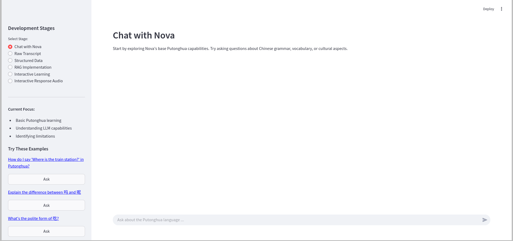
*Caption: Launch screen showing the Putonghua Learning Assistant*

### Navigation

The app provides six main learning modules:
1. Chat with Nova - Your AI Language Tutor
2. Video Transcripts - Learn from YouTube Content
3. Structured Lessons - Organized Learning Materials
4. Smart Learning - Context-Aware Practice
5. Interactive Practice - Custom Exercises
6. Audio Learning - Pronunciation Practice

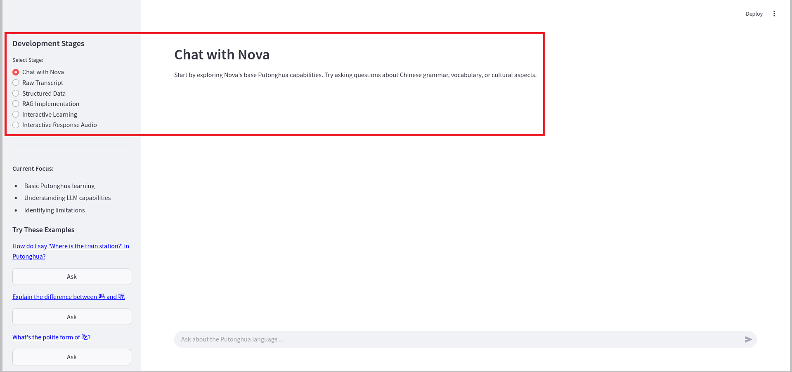
*Caption: Welcome screen and navigation sidebar showing all learning modules*

### Learning Modules in Action

#### 1. Chat with Nova
Your personal AI tutor helps with:
- Grammar explanations
- Vocabulary practice
- Cultural insights
- Pronunciation tips

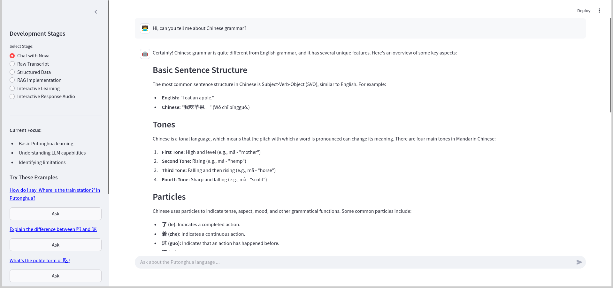
*Caption: Chat with Nova about Chinese grammar*

#### 2. YouTube Transcript Processing
Transform YouTube content into learning materials:
- Automatic transcript download
- Chinese character analysis
- Text cleaning and formatting
- Content organization
- Saving text and embeddings data

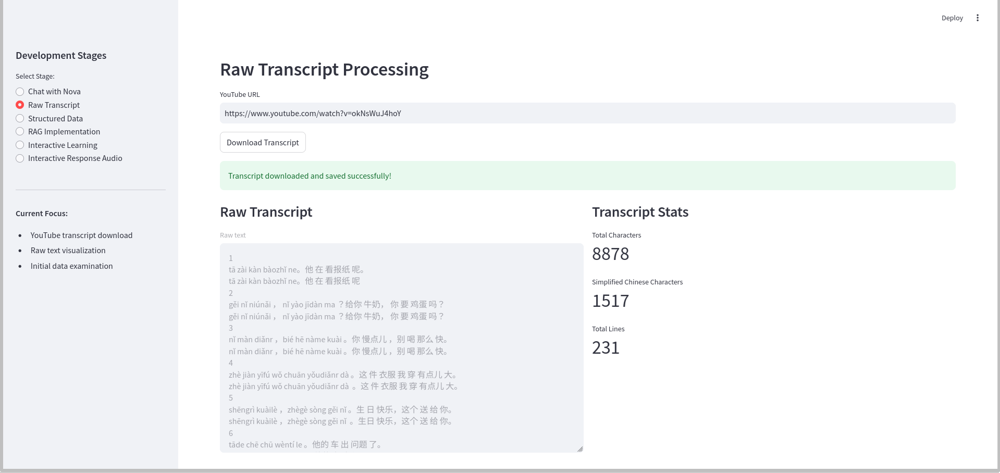
*Caption: Raw transcript processing interface showing downloaded content and analysis*

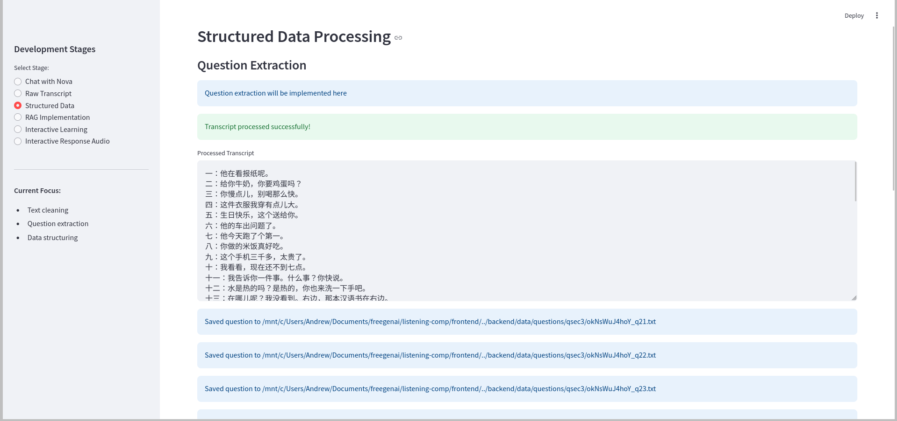
*Caption: Structured data processing interface showing data processing and saving (part 1)*

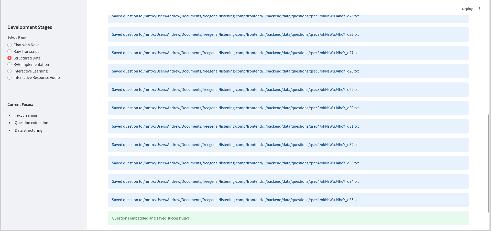
*Caption: Structured data processing interface showing data processing and saving (part 2)*

#### 3. RAG Implementation
Transform AI responses with context-aware learning:
- Vector database integration
- Semantic search capabilities
- Context-enriched responses
- Dynamic knowledge updates

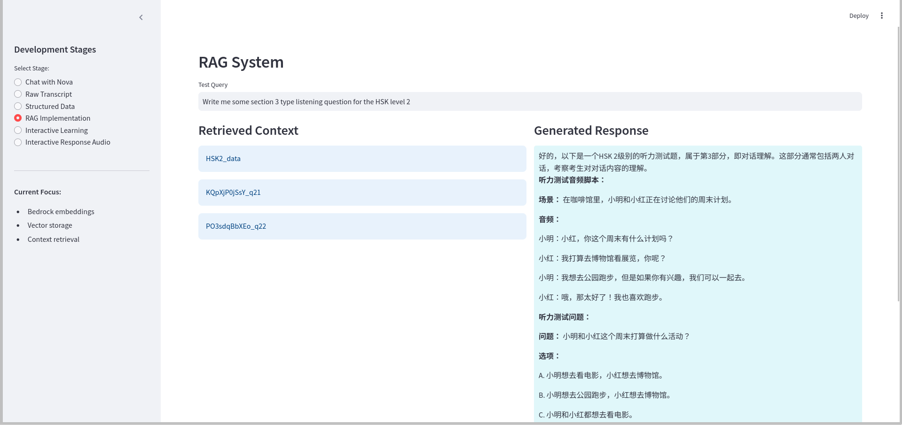
*Caption: RAG implementation showing semantic search and context-aware responses (part 1)*

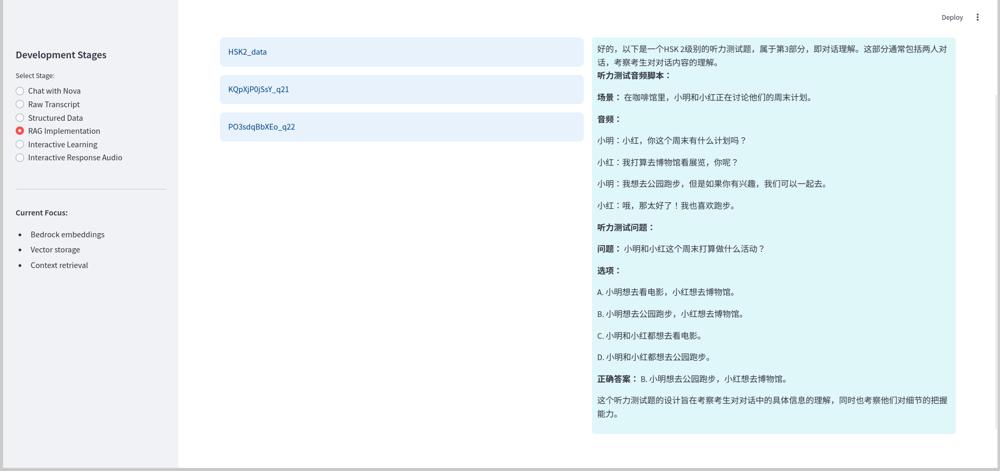
*Caption: RAG implementation showing semantic search and context-aware responses (part 2)*

#### 4. Interactive Learning
Practice with customizable scenarios:
- Topic selection
- Difficulty levels (HSK-based)
- Question types
- Context-aware exercises

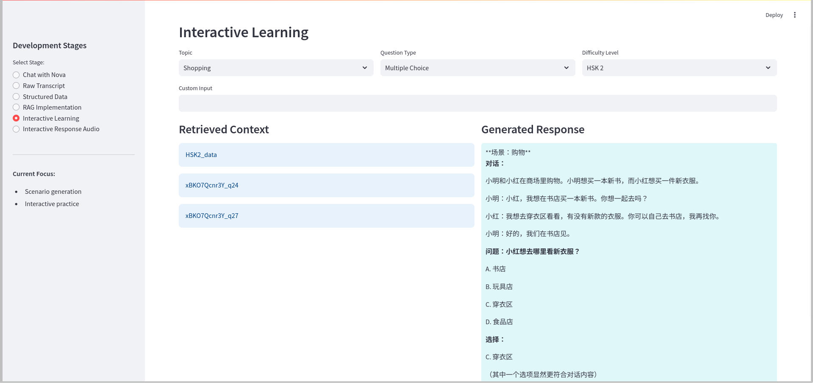
*Caption: Interactive learning interface showing topic selection and exercise generation*

#### 5. Audio Generation
Listen to clear pronunciations:
- Text-to-speech conversion
- Audio file management
- Playback controls
- Response recording

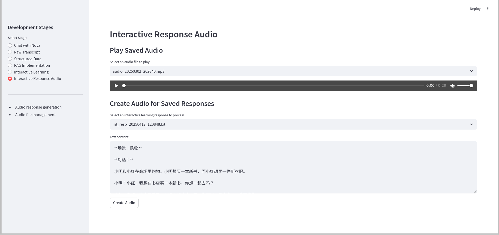
*Caption: Audio interface showing playback controls and file management*

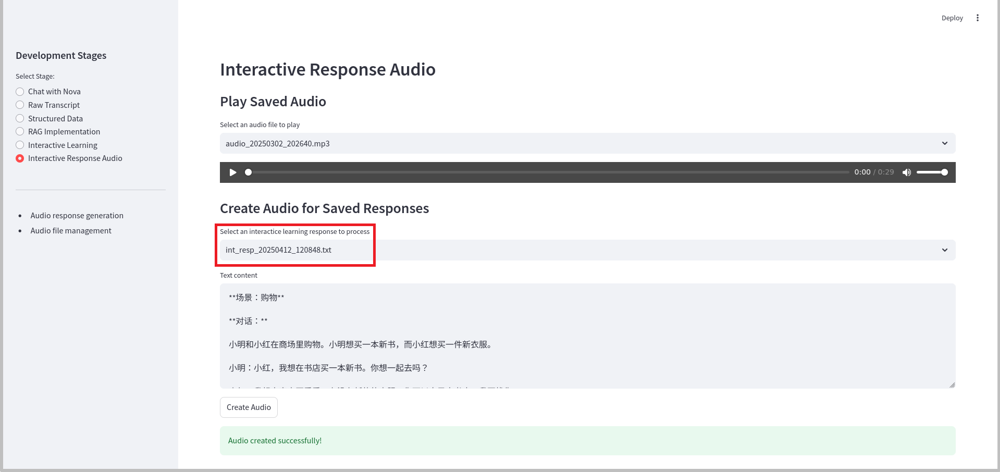
*Caption: Audio interface showing audio generation with text source highlighted*

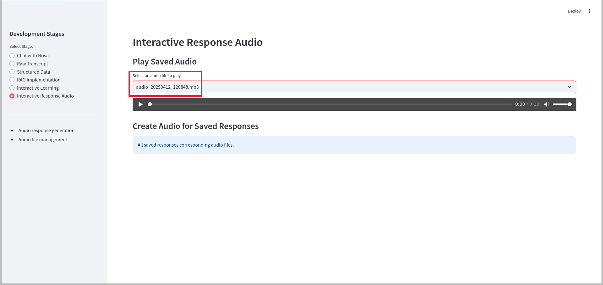
*Caption: Audio interface showing generated audio with identifying details highlighted*

## Learning Tips

### Best Practices for Learners

1. **Start Smart**:
   - Begin with Nova for foundational concepts
   - Use YouTube content for real-world practice
   - Combine listening and speaking exercises
   - Review materials regularly

2. **Maximize Your Learning**:
   - Practice with varied content types
   - Use audio support consistently
   - Save useful materials for review
   - Track your progress regularly

## Getting Started

1. Choose your preferred learning module from the sidebar
2. Start with basic conversations with Nova
3. Progress to YouTube content for authentic language exposure
4. Practice with interactive exercises
5. Use audio tools for pronunciation practice

## Conclusion

The Putonghua Learning Assistant offers a modern approach to language learning, combining AI tutoring with practical exercises. Whether you're just starting with Putonghua or looking to improve your skills, the application provides all the tools you need for effective learning.

For technical details and setup instructions, please refer to the [README](README.md).
