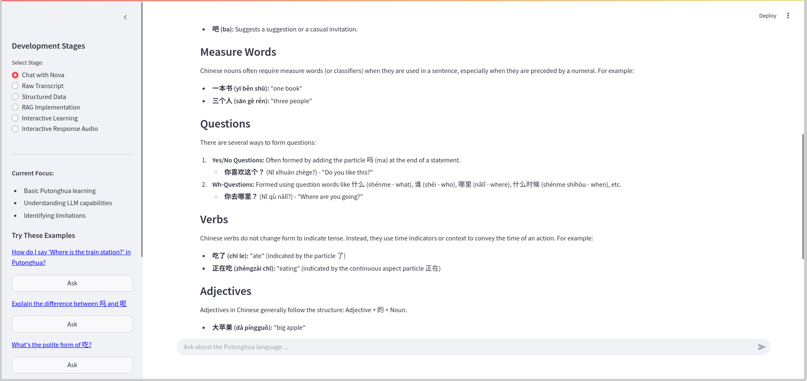
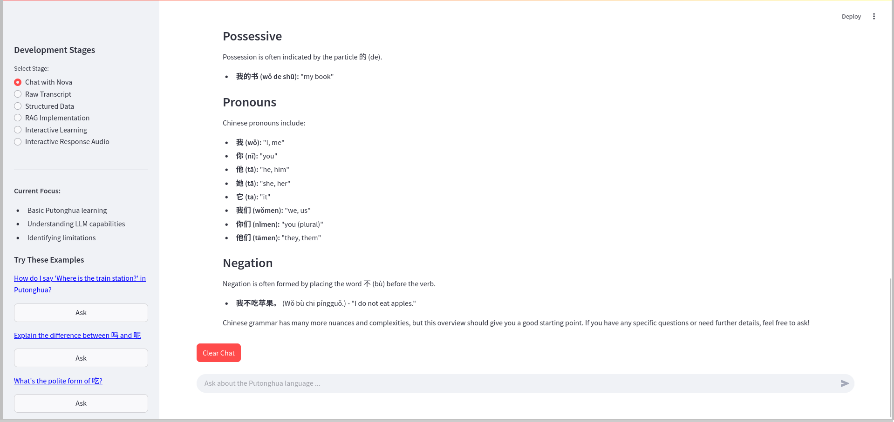

# Putonghua Learning Assistant Showcase

## Introduction

The Putonghua Learning Assistant is an advanced language learning application that transforms YouTube content into interactive Mandarin Chinese learning experiences. By combining AI technologies like Large Language Models (LLMs), Retrieval Augmented Generation (RAG), and text-to-speech capabilities, it creates a comprehensive platform for practicing Putonghua listening and comprehension skills.

## Overview of Features

The application offers a rich set of features for language learners:

- **AI-Powered Chat**: Interact with Nova, an AI tutor for Putonghua learning
- **YouTube Integration**: Extract and process Chinese language content from YouTube videos
- **Structured Learning**: Convert raw transcripts into organized learning materials
- **Interactive Exercises**: Generate custom practice scenarios based on HSK levels
- **Audio Generation**: Create clear audio pronunciations for practice materials
- **RAG Technology**: Leverage context-aware responses using advanced AI
- **Progress Tracking**: Monitor learning progress across different topics

## Feature Tour

### Launch the App

Start the Putonghua Learning Assistant using Streamlit:

```bash
streamlit run frontend/main.py
```


*Caption: Launch screen showing the Putonghua Learning Assistant*

### Home Screen

The application features a modern, wide-layout interface with:
- Clean, intuitive design
- Clear navigation sidebar
- Development stage indicators
- Welcome message and feature overview

### Navigation

The app is organized into six main development stages:
1. Chat with Nova
2. Raw Transcript
3. Structured Data
4. RAG Implementation
5. Interactive Learning
6. Interactive Response Audio


*Caption: Launch screen highlighting the welcome message and sidebar navigation showing all six development stages with descriptions*

### Key Features in Action

#### 1. Chat with Nova
Engage with an AI tutor for Putonghua learning:
- Natural language interaction
- Grammar explanations
- Vocabulary assistance
- Cultural insights
- Example questions provided


*Caption: Chat interface showing conversation with Nova about Chinese grammar (part 1)*


*Caption: Chat interface showing conversation with Nova about Chinese grammar (part 2)*


*Caption: Chat interface showing conversation with Nova about Chinese grammar (part 3)*

#### 2. YouTube Transcript Processing
Transform YouTube content into learning materials:
- Automatic transcript download
- Chinese character analysis
- Text cleaning and formatting
- Content organization
- Saving text and embeddings data


*Caption: Raw transcript processing interface showing downloaded content and analysis*


*Caption: Structured data processing interface showing data processing and saving (part 1)*


*Caption: Structured data processing interface showing data processing and saving (part 2)*

#### 3. RAG Implementation
Transform AI responses with context-aware learning:
- Vector database integration
- Semantic search capabilities
- Context-enriched responses
- Dynamic knowledge updates


*Caption: RAG implementation showing semantic search and context-aware responses (part 1)*


*Caption: RAG implementation showing semantic search and context-aware responses (part 2)*

#### 4. Interactive Learning
Practice with customizable scenarios:
- Topic selection
- Difficulty levels (HSK-based)
- Question types
- Context-aware exercises


*Caption: Interactive learning interface showing topic selection and exercise generation*

#### 5. Audio Generation
Listen to clear pronunciations:
- Text-to-speech conversion
- Audio file management
- Playback controls
- Response recording


*Caption: Audio interface showing playback controls and file management*


*Caption: Audio interface showing audio generation with text source highlighted*


*Caption: Audio interface showing generated audio with identifying details highlighted*

## User Experience Guidance

### Pro Tips

1. **Effective Learning**:
   - Start with Nova for basic concepts
   - Use YouTube content for real-world practice
   - Combine listening and speaking exercises
   - Review generated content regularly

2. **Feature Integration**:
   - Mix different learning modes
   - Use RAG for context-aware practice
   - Save audio for offline review
   - Track progress across topics

### Best Practices

- Begin with familiar topics
- Gradually increase difficulty
- Use audio support consistently
- Practice with varied content
- Review generated exercises
- Combine different learning modes
- Save useful materials for later review

## Conclusion

The Putonghua Learning Assistant transforms traditional language learning by combining AI technology with practical learning tools. Whether you're a beginner starting with basic concepts or an advanced learner seeking to improve listening comprehension, the application provides a comprehensive platform for enhancing your Putonghua skills.

The integration of AI chat, YouTube content, interactive exercises, and audio support creates a dynamic learning environment that adapts to your needs and helps you progress effectively in your language learning journey.
