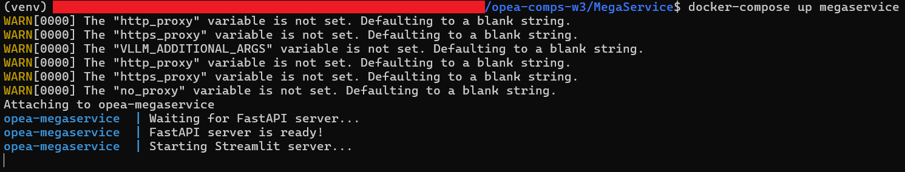
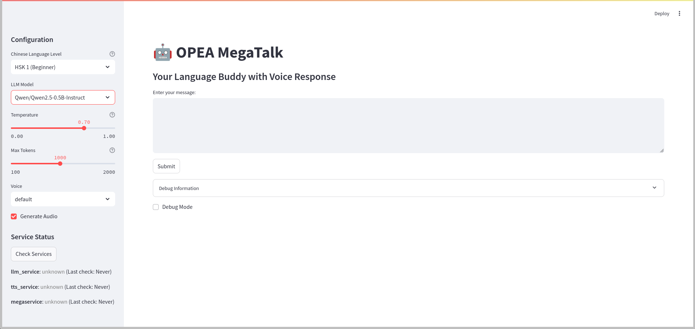
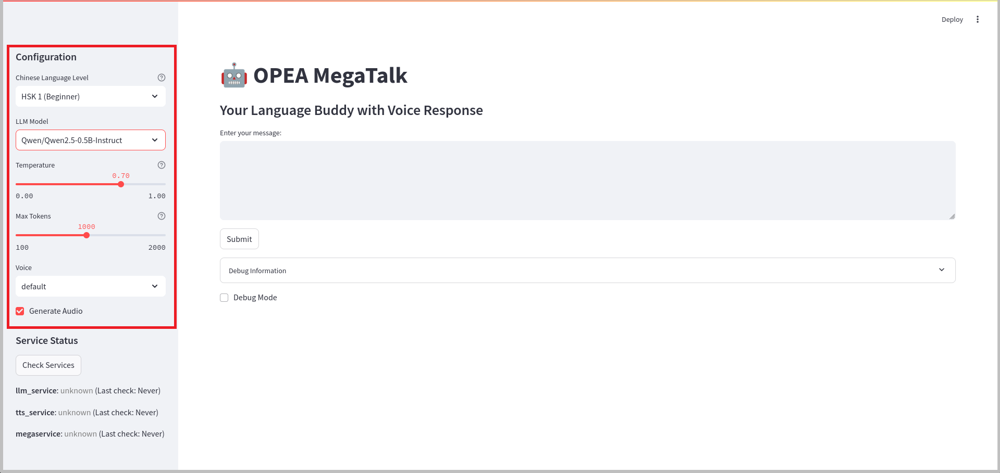
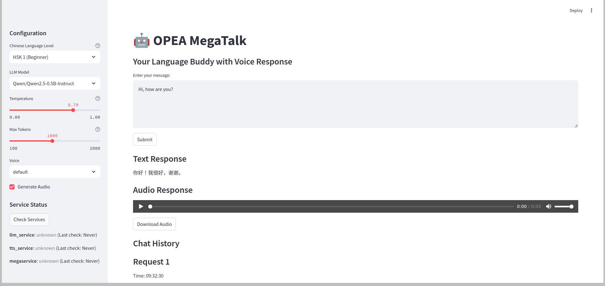

# OPEA MegaService Showcase

## Introduction

OPEA MegaService is a sophisticated AI service orchestrator that combines Language Learning Models (LLM) and Text-to-Speech (TTS) capabilities into a unified API. Built with FastAPI and designed for high performance, it provides seamless integration between OpenVINO-optimized LLMs and GPT-SoVITS voice synthesis, making it ideal for creating interactive AI applications with voice capabilities.

## Overview of Features

OPEA MegaService offers a comprehensive set of features:

- **Unified API**: Combined LLM and TTS endpoints in one service
- **Health Monitoring**: Real-time service health tracking
- **Audio Management**: Built-in audio file handling and serving
- **Flexible Configuration**: Customizable service parameters
- **Streaming Support**: Real-time response capabilities
- **Logging System**: Comprehensive logging with rotation
- **Error Handling**: Robust error management and reporting

## Feature Tour

### Launch the App

Start the MegaService using Docker Compose:

```bash
docker-compose up megaservice
```


*Caption: Starting Megaservice using docker*

Navigate to http://localhost:8501/:


*Caption: OPEA Comps Megaservice main interface*

### Key Features in Action

#### 1. Chat Configuration
Configuration Settings:
- Model selection
- Temperature control
- Token management
- Streaming responses
- Audio generation


*Caption: Highlighted OPEA Comps Megaservice configuration settings*

#### 2. Chat Function
Use the unified MegaService endpoint:
- Single request processing
- Combined text and audio responses
- Chat History
- Error handling


*Caption: OPEA Comps Megaservice chat function (part 1)*


*Caption: OPEA Comps Megaservice chat function (part 2)*

## User Experience Guidance

### Pro Tips

1. **Service Configuration**: 
   - Set appropriate timeouts for TTS
   - Configure logging rotation
   - Use health checks for monitoring

2. **API Usage**:
   - Leverage streaming for real-time responses
   - Handle audio data efficiently
   - Monitor service health status

3. **Performance Optimization**:
   - Use appropriate model parameters
   - Manage audio file cleanup
   - Monitor resource usage

### Best Practices

- Monitor service health regularly
- Clean up old audio files
- Use appropriate timeout values
- Handle errors gracefully
- Implement proper logging
- Test endpoints before deployment

## Conclusion

OPEA MegaService provides a powerful platform for building AI applications that combine text and voice capabilities. Its unified API and robust architecture make it easy to create sophisticated applications that leverage both LLM and TTS technologies.

Whether you're building a conversational AI system, a voice assistant, or any application that needs both text and speech capabilities, OPEA MegaService provides the infrastructure and tools needed to create reliable and scalable solutions.
