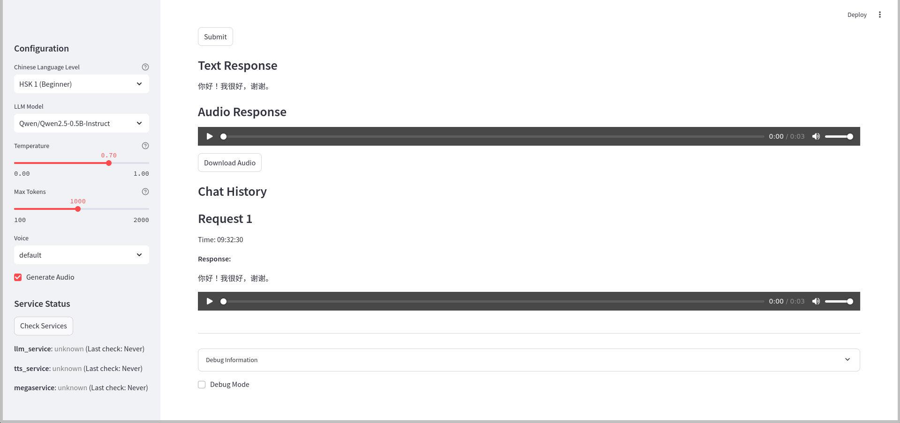

# OPEA MegaService Showcase

## Introduction

Welcome to the visual tour of OPEA MegaService! This showcase demonstrates the key features and capabilities of our AI service that combines Language Learning Models (LLM) and Text-to-Speech (TTS) capabilities. For technical details and implementation, please see our [README.md](README.md).

## Visual Feature Tour

### Getting Started

Start the MegaService using Docker Compose:

```bash
docker-compose up megaservice
```


*Caption: Starting Megaservice using docker*

Navigate to http://localhost:8501/ to access the interface:


*Caption: OPEA Comps Megaservice main interface*

### Interactive Features

#### 1. Chat Configuration
The interface provides intuitive controls for:
- Model selection
- Temperature control
- Token management
- Streaming responses
- Audio generation


*Caption: Highlighted OPEA Comps Megaservice configuration settings*

#### 2. Chat Experience
Experience the unified chat interface with:
- Real-time text responses
- Automatic audio generation
- Interactive chat history
- Clear error feedback


*Caption: OPEA Comps Megaservice chat function (part 1)*


*Caption: OPEA Comps Megaservice chat function (part 2)*

## Usage Tips

### For Best Results

1. **Configuration Tips**: 
   - Start with default temperature settings
   - Adjust token limits based on your needs
   - Enable streaming for real-time responses

2. **Chat Best Practices**:
   - Use clear, concise prompts
   - Check audio playback settings
   - Review chat history for context

3. **Troubleshooting**:
   - Refresh page if audio doesn't play
   - Check network connection
   - Clear browser cache if needed

## Learn More

For technical details, deployment instructions, and development information, please refer to:
- [Main Project README](../README.md)
- [Implementation README](README.md)
