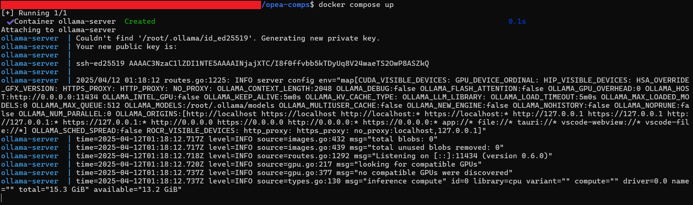
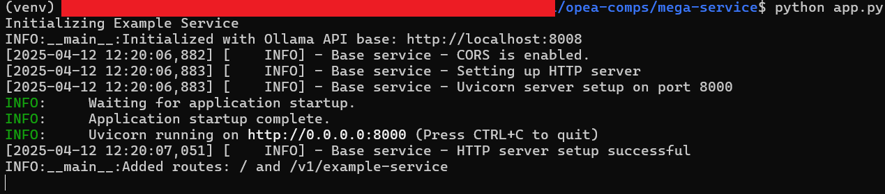
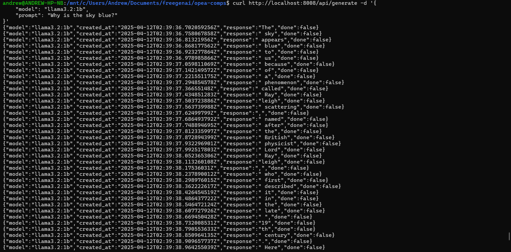

# OPEA Comps Showcase

## Introduction

OPEA Comps (Open-source Protocol for Extensible AI Components) is a sophisticated microservices architecture for AI applications. It provides a standardized way to build, deploy, and orchestrate AI services, with a particular focus on language models and embeddings. The system is designed to make AI services more modular, scalable, and easier to maintain.

## Overview of Features

OPEA Comps offers a comprehensive set of features for AI service orchestration:

- **Service Orchestration**: Coordinate multiple AI services seamlessly
- **Standardized Protocols**: Consistent API interfaces across services
- **LLM Integration**: Built-in support for language models via Ollama
- **Streaming Support**: Real-time response streaming capabilities
- **Service Discovery**: Automatic service registration and discovery
- **Error Handling**: Robust error management and logging
- **Extensible Architecture**: Easy addition of new AI services

## Feature Tour

### Launch the App

Start the OPEA Comps services using Docker Compose:

```bash
docker-compose up
```


*Caption: OPEA Comps services starting up in Docker containers*

Download (pull) a model:

```bash
curl http://localhost:8008/api/pull -d '{
    "model": "llama3.2:1b"
}'
```

Launch the FastAPI server:
```bash
python mega-service/app.py
```


*Caption: FastAPI server starting*

### Generate a Request

```bash
curl http://localhost:8008/api/generate -d '{
    "model": "llama3.2:1b",
    "prompt": "Why is the sky blue?"
}'
```


*Caption: Megaservice was not completed but the Ollama AI and FastAPI server were successfully implemented for text generation*

## Conclusion

OPEA Comps provides a robust foundation for building AI-powered applications through its microservices architecture. The standardized protocols and service orchestration capabilities make it easier to develop, deploy, and maintain complex AI systems.

Whether you're building a chat application, an embedding service, or a complete AI platform, OPEA Comps offers the infrastructure and tools needed to create reliable and scalable AI services.
