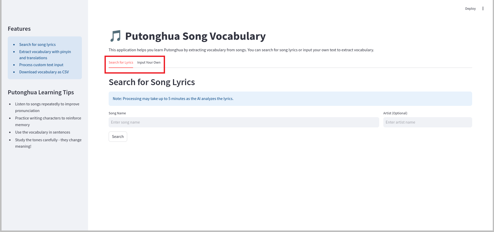

# Song-Vocab Showcase

## Introduction

Song-Vocab is an innovative language learning tool that helps users learn Putonghua (Standard Mandarin Chinese) through music. The app automatically extracts vocabulary from Chinese song lyrics or user-provided text, providing translations, pinyin pronunciations, and downloadable study materials. It's designed to make Chinese language learning more engaging and contextual through popular music.

## Overview of Features

Song-Vocab offers a comprehensive set of features for music-based language learning:

- **Lyrics Search**: Find Chinese song lyrics by title and artist
- **Vocabulary Extraction**: AI-powered identification of key vocabulary
- **Translation Support**: Automatic word translations and pinyin
- **Custom Text Analysis**: Process any Chinese text for vocabulary
- **Data Export**: Download vocabulary lists in CSV format
- **User-Friendly Interface**: Clean, intuitive tabbed design

## Feature Tour

### Home Screen

The app features a clean, modern interface with:
- Clear title and description
- Two main function tabs
- Wide-layout design for better readability

*Caption: Song-Vocab launch screen*

### Navigation

The app is organized into two main tabs:

1. Search for Lyrics: Find and analyze songs
2. Input Your Own: Process custom text

*Caption: Highlighted navigation tabs showing both main sections*

### Key Features in Action

#### 1. Song Search
Search for songs with optional artist filtering:
- Song name input field
- Optional artist name
- Progress tracking
- Source attribution

*Caption: Highlighted song search interface showing search fields and controls*

#### 2. Lyrics Display
View the found lyrics with:
- Organized table view
- Column sorting
- Data filtering
- CSV download option

*Caption: Lyrics display showing Chinese text and translations*

#### 3. Lyrics Input
Process your own Chinese lyrics:
- Large text input area
- Real-time processing
- Immediate vocabulary extraction

*Caption: Custom text input interface showing the text area and processing options*

*Caption: Processed lyrics display with vocabulary extraction*

## User Guide

### Pro Tips

1. **Efficient Searching**: 
   - Include artist name for more accurate results
   - Wait for processing to complete
   - Check source attribution for accuracy

2. **Text Processing**:
   - Use clear, well-formatted text
   - Process in manageable chunks
   - Review extracted vocabulary carefully

3. **Data Management**:
   - Download vocabulary lists regularly
   - Sort by different columns
   - Use filters for focused study

### Best Practices

- Start with well-known songs
- Verify lyrics sources
- Export vocabulary regularly
- Process text in reasonable sizes
- Check translations for context
- Use both search and custom input features

## Conclusion

Song-Vocab transforms Chinese music into an effective language learning tool. By combining web search capabilities with AI-powered vocabulary extraction, it provides a unique and engaging way to expand your Chinese vocabulary through music.

Whether you're a beginner looking to learn through popular songs or an advanced learner seeking to analyze specific texts, Song-Vocab offers the tools and features needed to make learning Chinese more enjoyable and effective.

---
For technical documentation and setup instructions, please see the [main README](../README.md).
