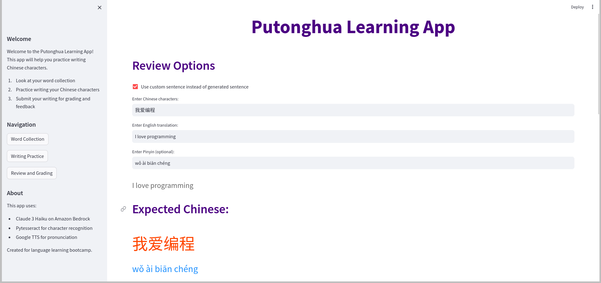

# Writing Practice Showcase

## Introduction

Writing Practice is an innovative language learning application designed to help users improve their Chinese handwriting skills through interactive practice sessions. The app combines AI-powered sentence generation, text-to-speech capabilities, and handwriting recognition to create a comprehensive learning experience for Putonghua (Standard Mandarin Chinese) students.

## Overview of Features

Writing Practice offers a rich set of features for language learners:

- **Word Collection**: Browse and manage your Chinese vocabulary
- **Smart Sentence Generation**: AI-powered sentence creation using selected words
- **Audio Support**: Text-to-speech for pronunciation guidance
- **Handwriting Recognition**: OCR-based writing assessment
- **Custom Practice**: Input your own sentences for practice
- **Progress Tracking**: Review and grade your writing attempts
- **Bilingual Support**: English and Chinese translations with Pinyin

## Getting Started

To begin using Writing Practice:

1. Launch the application following the setup instructions in the README
2. Navigate to the Word Collection section to explore vocabulary
3. Move to Writing Practice to generate sentences and practice writing
4. Use the Review section to get feedback on your handwriting

## Feature Tour

### Home Screen

The app features a modern, wide-layout interface with:
- Clear navigation sidebar
- Welcome message and instructions
- Three main sections: Word Collection, Writing Practice, and Review
- Clean, intuitive design optimized for learning

*Caption: Writing Practice launch screen showing vocabulary extraction from Lang-Portal*

### Navigation

The app is organized into three main sections accessible from the sidebar:

1. Word Collection: Browse and manage vocabulary
2. Writing Practice: Generate and practice writing sentences
3. Review and Grading: Check and assess your writing

*Caption: Highlighted sidebar navigation showing all three main sections*

### Key Features in Action

#### 1. Word Collection
Browse and select from your vocabulary:
- Searchable word list
- English translations
- Pinyin pronunciations
- Large, clear Chinese characters

*Caption: Highlighted Word Collection interface showing the vocabulary table with translations*

#### 2. Writing Practice
Practice writing with generated sentences:
- Word selection options
- Random word choice
- Custom word input
- Sentence generation

*Caption: Navigated to Writing Practice section showing word selection and sentence generation options*

*Caption: Writing Practice section showing sentence generation output*

Learner Support:
- Audio pronunciation
- Pinyin toggle

*Caption: Audio playback controls with the sentence displayed*

#### 3. Review and Grading
Check your writing progress:
- Image upload for written work
- OCR recognition
- Automatic grading
- Detailed feedback
- Custom sentence input option

*Caption: Navigated to Review and Grading section showing review options and expected Chinese writing*

*Caption: Uploaded image of writing practice*

*Caption: Grading and feedback (Part 1)*

*Caption: Grading and feedback (Part 2)*

## User Experience Guidance

### Pro Tips

1. **Efficient Practice**:
   - Use the random word selector for varied practice
   - Listen to audio before writing
   - Toggle Pinyin for pronunciation help
   - Review feedback carefully

2. **Custom Practice**:
   - Input your own sentences
   - Use the translation feature
   - Practice specific vocabulary
   - Track your progress

### Best Practices

- Start with simple words and sentences
- Practice writing characters in the correct stroke order
- Use audio playback for pronunciation guidance
- Review your writing regularly
- Take advantage of the automatic grading system
- Mix generated and custom sentences for comprehensive practice

## Conclusion

Writing Practice transforms Chinese character writing practice into an engaging and effective learning experience. By combining AI-powered sentence generation, audio support, and automatic grading, it provides a complete solution for improving Chinese handwriting skills.

Whether you're a beginner learning basic characters or an advanced student practicing complex sentences, Writing Practice offers the tools and features needed to enhance your Chinese writing abilities in an interactive and enjoyable way.
