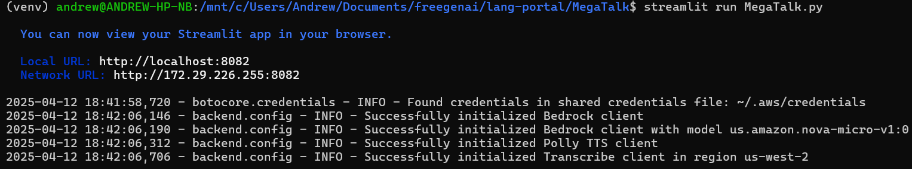
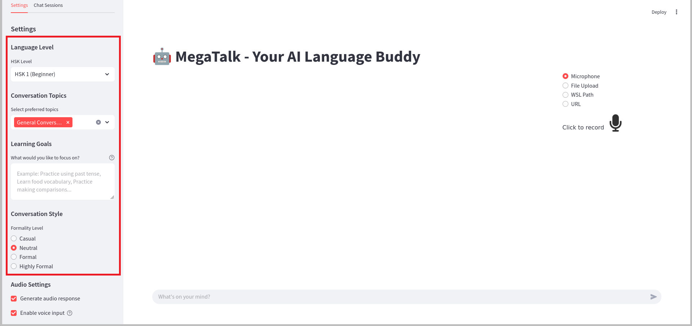
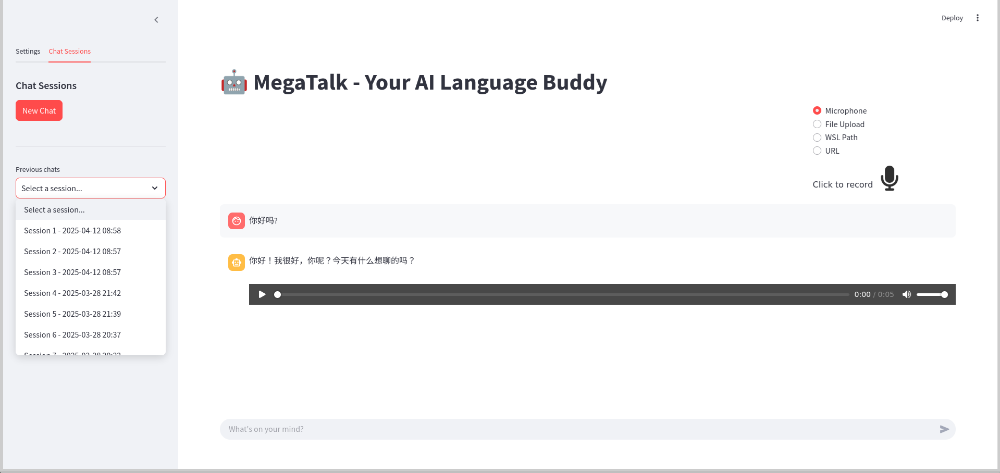

# MegaTalk

An AI-powered conversational language learning application that combines voice interaction, AI-powered chat, and adaptive learning technologies. Using AWS Bedrock, Amazon Transcribe, and Amazon Polly, the app creates an immersive environment for practicing spoken Chinese through natural conversations with an AI tutor.

## Overview

MegaTalk enhances language learning through natural conversation by combining:
- AWS Bedrock for AI-powered chat responses
- Amazon Transcribe for voice input processing
- Amazon Polly for high-quality speech synthesis
- Lang Portal integration for centralized learning management
- Streamlit interface for user interaction

## Prerequisites

1. **AWS Setup**
   - AWS CLI installed and configured
   - Access to AWS Bedrock service
   - Access to Amazon Transcribe
   - Access to Amazon Polly
   - AWS Region set to us-west-2 (required for Bedrock)
   - Appropriate IAM permissions for AWS services

2. **Lang Portal Backend**
   - Running Lang Portal backend service
   - Default URL: http://localhost:5000

3. **System Dependencies**
   - Python 3.8+
   - FFmpeg (for audio processing)
   - Microphone access (for voice input)

## Installation & Configuration

1. **Install Python Dependencies**
   ```bash
   pip install -r requirements.txt
   ```

2. **Configure AWS**
   ```bash
   aws configure
   ```
   Enter:
   - AWS Access Key ID
   - AWS Secret Access Key
   - Default region (us-west-2)
   - Output format (json)

3. **Verify Setup**
   ```bash
   # Check AWS credentials
   aws sts get-caller-identity
   ```

## Getting Started

1. **Start Lang Portal Backend**
```bash
   cd path/to/lang-portal/backend-flask
   python app.py
   ```

2. **Launch MegaTalk**
   ```bash
   streamlit run MegaTalk.py
   ```
   
   *MegaTalk initialization showing AWS configuration check*

## Features and Interface

### 1. Main Interface
The app features a modern, wide-layout interface with three main areas:
- Chat window for conversations
- Sidebar for settings and navigation
- Voice input controls


*Main interface showing the chat window and control panels*


*Highlighted navigation sidebar session management and settings options*

### 2. Learning Configuration
Customize your learning experience with:
- HSK Level Selection (HSK 1-6)
- Topic Selection
- Formality Level
- Learning Goals


*Learning configurations showing HSK levels and topic selection*

### 3. Voice Interaction
Engage in natural conversations using:
- Real-time voice input
- High-quality audio responses
- Transcription feedback


*Voice interaction interface showing audio controls and transcription*

### 4. Session Management
Manage your learning sessions:
- View previous conversations
- Load past sessions
- Delete old chats


*Chat history interface showing saved sessions and management options*


*Chat history interface showing loaded session and management options*

## Technical Implementation

### Architecture
```
MegaTalk/
├── MegaTalk.py           # Main Streamlit application
├── backend/
│   ├── chat_service.py   # AWS Bedrock integration
│   ├── config.py         # Configuration settings
│   ├── prompts.py        # System prompts and HSK templates
│   ├── transcribe_client.py # Amazon Transcribe client
│   └── db_utils.py       # Database utilities
├── tools/
│   └── audio_utils.py    # Audio processing utilities
└── requirements.txt
```

### AWS Integration
- **AWS Bedrock**: Powers conversational AI with context-aware responses
- **Amazon Transcribe**: Real-time voice input processing
- **Amazon Polly**: High-quality Mandarin speech synthesis

### Configuration
```python
TRANSCRIBE_DEFAULTS = {
    "language_code": "cmn-CN",
    "sample_rate": 16000,
    "channels": 1
}

POLLY_DEFAULTS = {
    "Engine": "neural",
    "LanguageCode": "cmn-CN",
    "VoiceId": "Zhiyu"
}

BEDROCK_CONFIG = {
    "temperature": 0.7,
    "max_tokens": 2000,
    "model_id": "anthropic.claude-3-sonnet-20240229-v1:0"
}
```

### Audio Processing
- WAV format for voice input
- MP3 format for responses
- 16kHz sample rate
- Mono channel audio

### Database Schema
- Sessions table for conversation tracking
- Messages table for chat history
- User settings table for preferences

## Best Practices

### Voice Input
- Use a quiet environment
- Speak clearly at moderate pace
- Position microphone correctly
- Use headphones for better audio quality

### Learning Strategy
- Start with familiar topics
- Gradually increase difficulty
- Mix formal and informal styles
- Review past conversations regularly

### Session Management
- Save important conversations
- Use descriptive session names
- Clean up old sessions regularly
- Review challenging conversations

## Troubleshooting

### Common Issues

1. **AWS Connectivity**
   - Verify AWS credentials
   - Check service access
   - Confirm region setup

2. **Audio Issues**
   - Check microphone permissions
   - Verify FFmpeg installation
   - Test audio playback
   - Check internet connection

3. **Session Management**
   - Verify database permissions
   - Check storage space
   - Monitor session limits

### Error Logging
- Application logs in console
- Detailed error traces in Streamlit interface
- AWS CloudWatch integration
