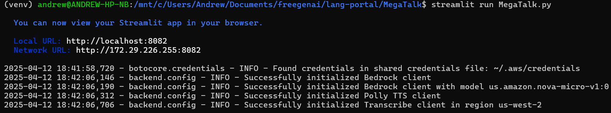
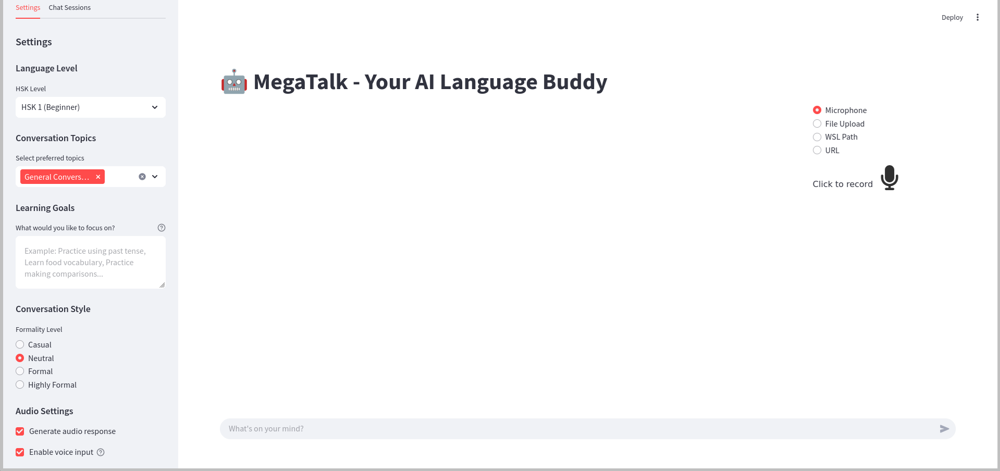
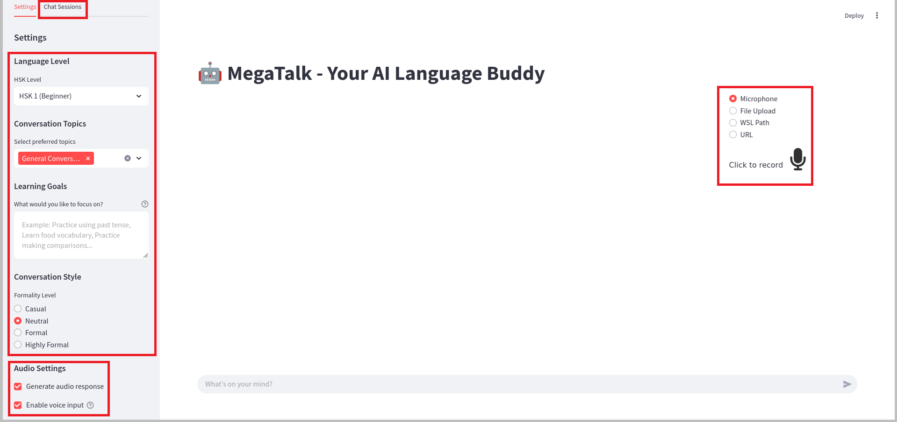
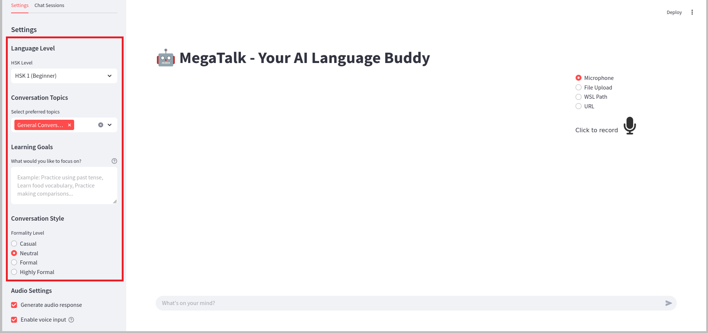
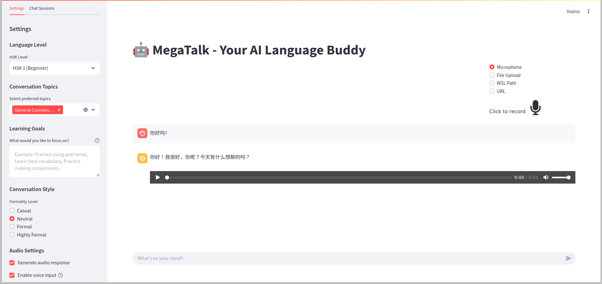
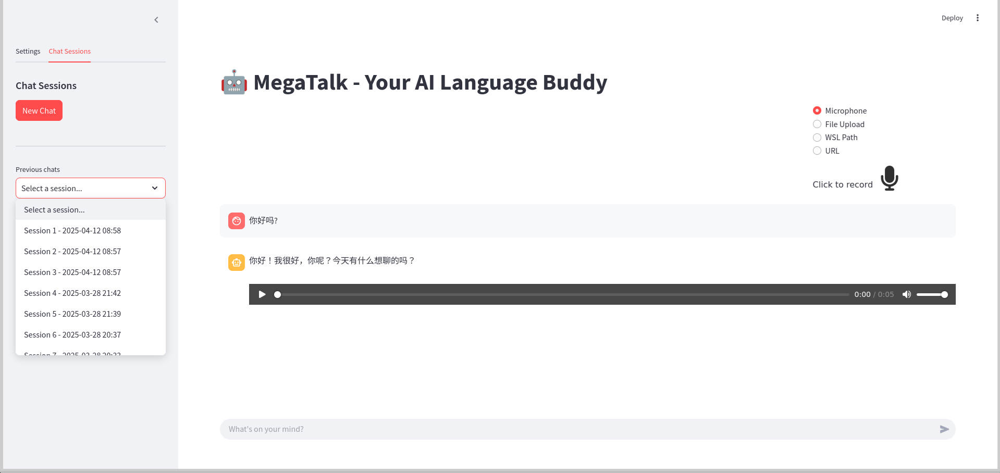
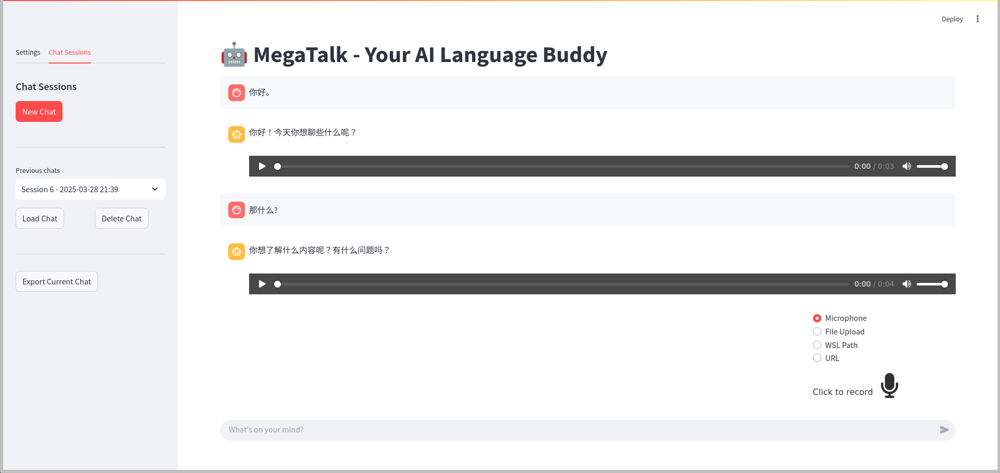

# MegaTalk Showcase

## Introduction

MegaTalk is an advanced conversational language learning application that combines voice interaction, AI-powered chat, and adaptive learning technologies. Using AWS Bedrock, Amazon Transcribe, and Amazon Polly, the app creates an immersive environment for practicing spoken Chinese through natural conversations with an AI tutor.

## Overview of Features

MegaTalk offers a comprehensive set of features designed for interactive language practice:

- **Voice-Enabled Chat**: Real-time voice input and response capabilities
- **Intelligent Conversation**: AI-powered chat system with contextual awareness
- **Customizable Learning**: Adjustable difficulty levels and conversation topics
- **Session Management**: Save and resume learning conversations
- **Audio Generation**: High-quality text-to-speech for pronunciation practice
- **Progress Tracking**: Historical chat records and learning analytics

## Feature Tour

### Launch the App

Start MegaTalk using Streamlit:

```bash
streamlit run MegaTalk.py
```


*Caption: MegaTalk initialization showing AWS configuration check*

### Home Screen

The home screen features a modern, wide-layout interface with three main areas:
- Chat window for conversations
- Sidebar for settings and navigation
- Voice input controls


*Caption: MegaTalk's main interface showing the chat window and control panels*

### Navigation

The app provides easy access to key features through the sidebar:

1. Chat Sessions: Browse, manage, and load past conversations
2. Learning Settings: Customize your learning experience
3. Voice Controls: Manage audio input/output settings


*Caption: Highlighted navigation sidebar session management and settings options*

### Key Features in Action

#### 1. Learning Configuration
Customize your learning experience with:
- HSK Level Selection (HSK 1-6)
- Topic Selection
- Formality Level
- Learning Goals


*Caption: Highlighted learning configurations showing HSK levels and topic selection*

#### 2. Voice Interaction
Engage in natural conversations using:
- Real-time voice input
- High-quality audio responses
- Transcription feedback


*Caption: Voice interaction interface showing audio controls and transcription*

#### 3. Chat History
Manage your learning sessions:
- View previous conversations
- Load past sessions
- Delete old chats


*Caption: Chat history interface showing saved sessions and management options*


*Caption: Chat history interface showing loaded session and management options*

## User Experience Guidance

### Pro Tips

1. **Voice Input Best Practices**: 
   - Speak clearly and at a moderate pace
   - Use a quiet environment
   - Position microphone correctly

2. **Learning Optimization**:
   - Start with familiar topics
   - Gradually increase difficulty
   - Review past conversations

3. **Session Management**:
   - Save important conversations
   - Name sessions for easy reference
   - Clean up old sessions regularly

### Best Practices

- Use headphones for better audio quality
- Practice with different topics to expand vocabulary
- Mix formal and informal conversation styles
- Save challenging conversations for later review
- Take advantage of the voice input feature for pronunciation practice

## Conclusion

MegaTalk represents a cutting-edge approach to language learning, combining voice technology with AI-powered conversation practice. The app's focus on natural interaction, coupled with its adaptive learning capabilities, makes it an invaluable tool for Chinese language learners at all levels.

Whether you're practicing basic conversations or working on advanced topics, MegaTalk provides the tools and guidance needed to improve your speaking skills. The combination of voice input, AI tutoring, and comprehensive session management creates a powerful platform for effective language learning.
