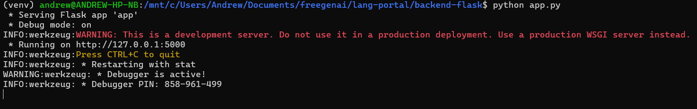
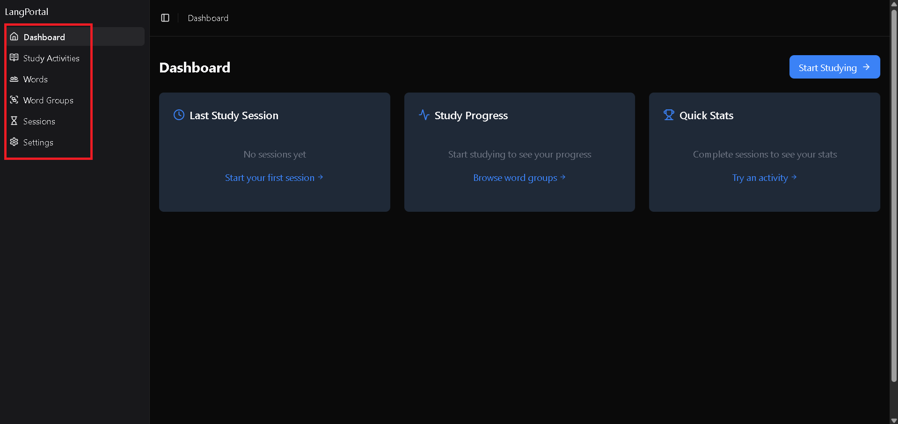
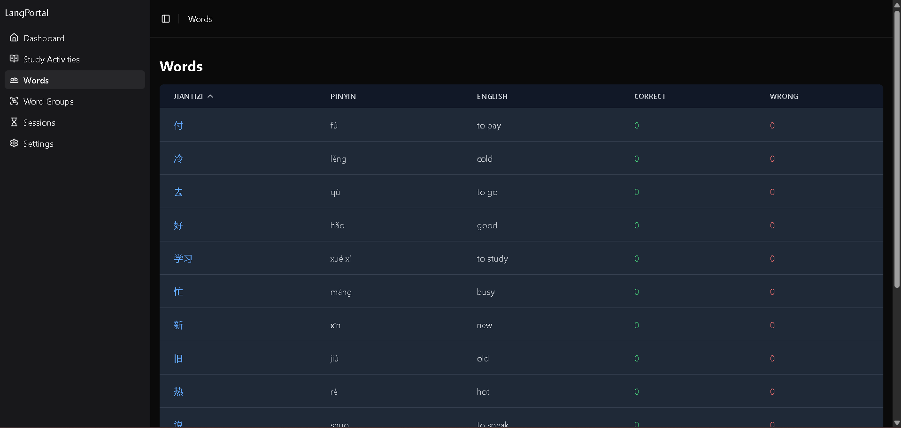
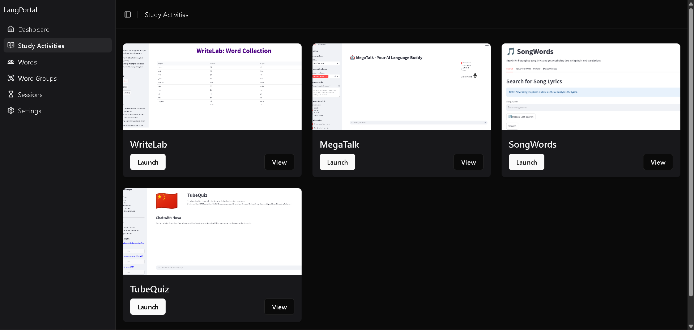
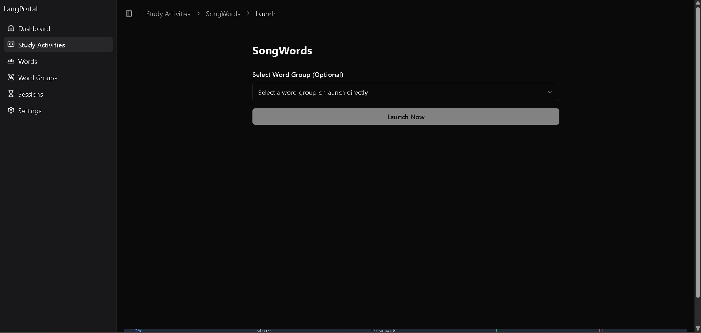
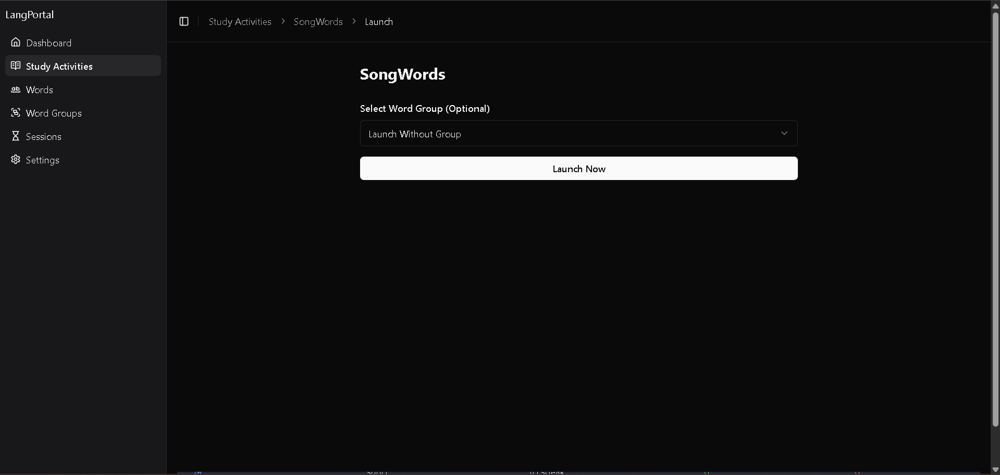
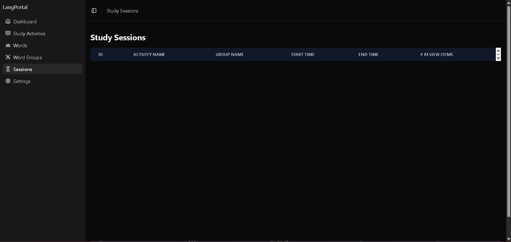

# Lang Portal

A comprehensive language learning platform that integrates multiple specialized applications for Chinese language learning, powered by AWS Bedrock and modern web technologies.

## Integrated Applications

- **WriteLab**: Chinese character writing practice with AI feedback
- **MegaTalk**: AI-powered conversational practice
- **TubeQuiz**: YouTube-based learning and quizzes
- **SongWords**: Chinese song lyrics vocabulary extraction

## System Requirements

### Backend Requirements
- Python 3.8+
- Node.js 14+
- SQLite3 with UTF-8 support
- AWS credentials configured for Bedrock access

### Frontend Requirements
- Noto Sans SC font (for Chinese characters)
- Source Sans Pro font (for pinyin display)

## Quick Start

1. **Clone and Setup**
```bash
git clone [repository-url]
cd lang-portal
```

2. **Choose Your Launch Method**

Using Docker (Recommended):
```bash
docker-compose up
```

Manual Setup:
```bash
# Backend
cd backend-flask
pip install -r requirements.txt
python app.py

# Frontend (in new terminal)
cd frontend-react
npm install
npm start
```


*Backend initialization with database connection*

## Core Features

### 1. Unified Platform
- Centralized data management
- Shared resources for Chinese characters and translations
- AWS Bedrock integration for AI capabilities
- Dark/light theme support


*Main application sections*

### 2. Word Management
- Create and organize vocabulary groups
- Track usage statistics
- Integrated pinyin support


*Word management interface with group organization*

### 3. Study Activities
- Launch integrated learning applications
- Track progress
- Word group focused learning session support


*Study activity selection and launch interface*


*Study activity launch selection*


*Study activity launch without group word data*

### 4. Progress Analytics
- Comprehensive study statistics
- Performance metrics
- Session history


*Progress tracking and analytics dashboard facility*

## Architecture

```
lang-portal/
├── backend-flask/        # Core backend services
├── frontend-react/       # Main web interface
├── MegaTalk/            # Conversation practice app
├── WriteLab/            # Character writing app
├── TubeQuiz/           # Video learning app
├── SongWords/          # Lyrics learning app
└── docker-compose.yaml  # Container orchestration
```

## Configuration

1. **AWS Setup**
- Configure AWS credentials for Bedrock access
- Set required environment variables in `.env`

2. **Database Setup**
```bash
cd backend-flask
flask db upgrade
```

3. **Application Configuration**
- Update `config.py` for backend settings
- Modify `.env` for frontend configuration

## Best Practices

### Development
- Enable TypeScript strict mode
- Use provided component library
- Follow API documentation

### Usage
- Organize words into logical groups
- Maintain regular study sessions
- Review analytics for improvement

## Individual Applications

See detailed setup and development guidelines:
- [WriteLab README](WriteLab/README.md)
- [MegaTalk README](MegaTalk/README.md)
- [TubeQuiz README](TubeQuiz/README.md)
- [SongWords README](SongWords/README.md)

## License

[License details]
