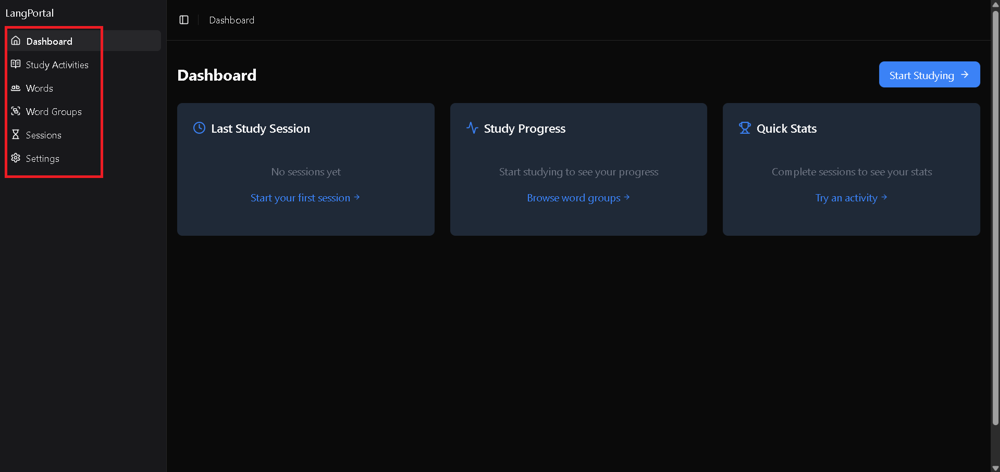
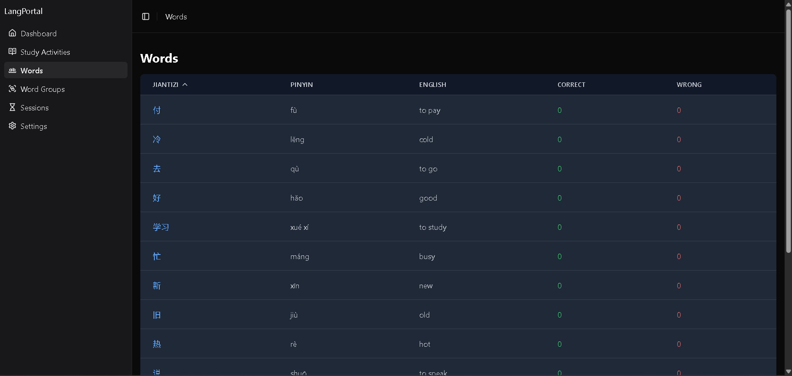
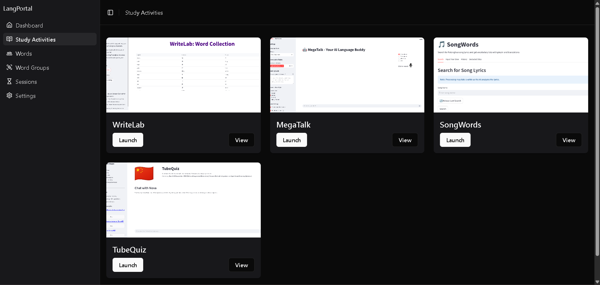
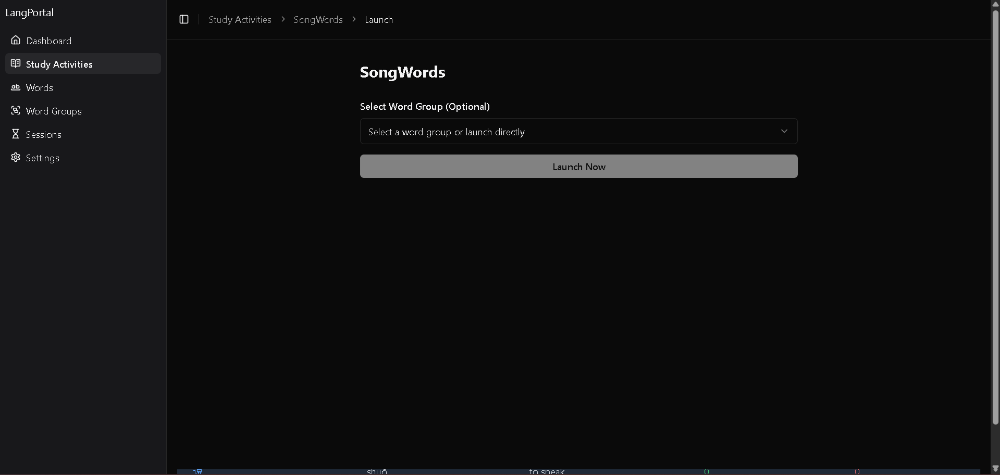
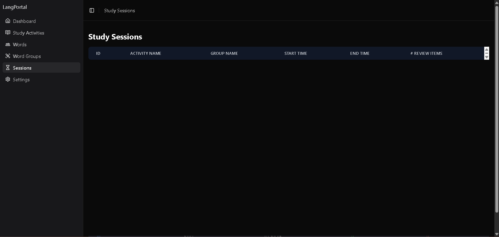

# Lang Portal Showcase

## Introduction

Lang Portal is a comprehensive language learning platform that combines a modern React frontend with a Flask backend to create an integrated environment for Chinese language study. The platform focuses on vocabulary management, study sessions, and progress tracking with a particular emphasis on Chinese character learning.

## Overview of Features

Lang Portal offers three main components designed to create a comprehensive learning experience:

- **Word Management**: Vocabulary organization and grouping
- **Study Activities**: Interactive learning sessions
- **Progress Tracking**: Comprehensive analytics and statistics

Key capabilities include:
- **Intelligent Group System**: Organize words into study groups
- **Multi-Activity Integration**: Support for various learning activities
- **Progress Analytics**: Detailed study session tracking
- **Dark Mode Support**: Customizable UI experience
- **Responsive Design**: Mobile-friendly interface

## Feature Tour

### Launch the App

1. Start the backend:
```bash
cd backend-flask
pip install -r requirements.txt
python app.py
```


*Caption: Flask backend initialization showing database connection*

2. Start the frontend:
```bash
cd frontend-react
npm install
npm run dev
```


*Caption: React frontend development server startup*

### Home Screen

The application features a modern, responsive interface with:
- Intuitive navigation sidebar
- Dark/light theme toggle
- Quick access to key features
- Real-time statistics dashboard


*Caption: Lang Portal home screen showing the dashboard with study statistics*

### Navigation

The app provides seamless navigation through four main sections:

1. Dashboard: Overview and statistics
2. Word Groups: Vocabulary organization
3. Study Activities: Learning sessions
4. Settings: Application configuration


*Caption: Highlighted navigation sidebar showing the main application sections*

### Key Features in Action

#### 1. Word Management
Create and manage vocabulary groups with detailed information:
- Chinese characters (Simplified)
- Pinyin pronunciation
- English translations
- Usage statistics


*Caption: Word management interface showing vocabulary groups and details*

#### 2. Study Activities
Launch and track learning sessions:
- Activity selection
- Activity launch
- Word group launch functionality
- Progress monitoring


*Caption: Study activity selection and launch interface*


*Caption: Study activity launch selection*


*Caption: Study activity launch without group word data*

Progress Tracking:
- Session history
- Performance metrics
- Time tracking


*Caption: Study session progress tracking and analytics facility*

## User Experience Guidance

### Pro Tips

1. **Initial Setup**: 
   - Use Docker Compose for easiest deployment
   - Configure environment variables if needed
   - Verify database initialization

2. **Development Workflow**: 
   - Enable TypeScript strict mode
   - Use provided component library
   - Follow API documentation

3. **Best Practices**:
   - Organize words into logical groups
   - Regular study sessions tracking
   - Review analytics for improvement

## Conclusion

Lang Portal represents a modern approach to language learning management, combining:
- Robust vocabulary organization
- Flexible study activity integration
- Comprehensive progress tracking
- Modern web technologies

The platform's Docker-based deployment and modular architecture make it ideal for both development and production environments. Whether you're managing a personal study routine or integrating with other learning tools, Lang Portal provides the foundation for effective language learning.
