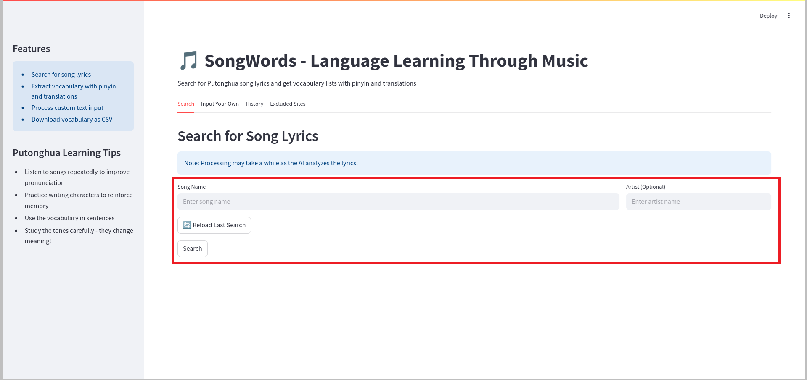
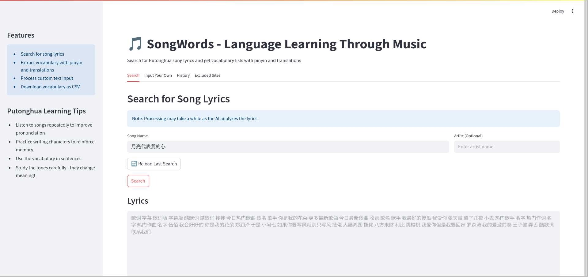
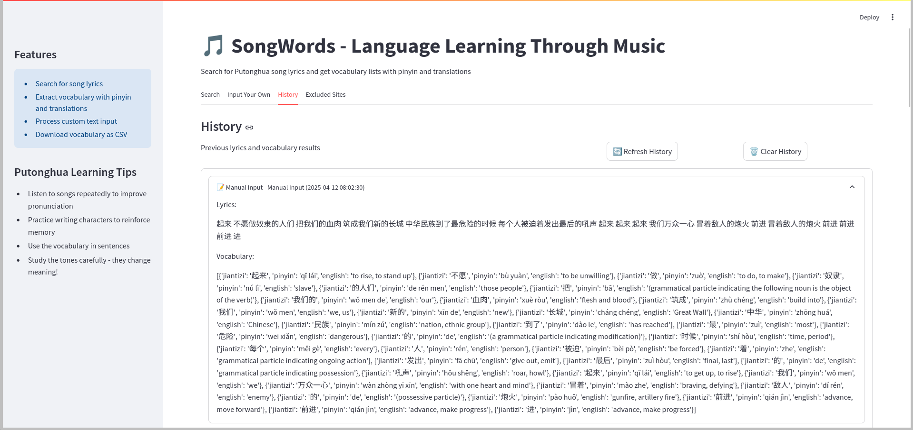
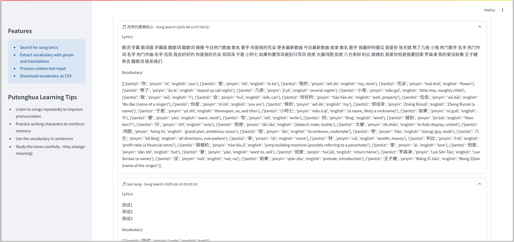

# SongWords

An AI-powered Chinese song lyrics vocabulary extractor, integrated with Lang Portal and powered by AWS Bedrock.

## Overview

SongWords transforms Chinese music into an effective language learning tool by combining:
- AWS Bedrock for AI-powered vocabulary extraction and translations
- Web search capabilities for finding Chinese song lyrics
- SQLite database for storing processed songs and vocabulary
- Lang Portal integration for centralized learning management
- Streamlit interface for user interaction

## Prerequisites

1. **AWS Setup**
   - AWS CLI installed and configured
   - Access to AWS Bedrock service
   - AWS Region set to us-west-2 (required for Bedrock)
   - Appropriate IAM permissions for Bedrock and other AWS services

2. **Lang Portal Backend**
   - Running Lang Portal backend service
   - Default URL: http://localhost:5000

3. **System Dependencies**
- Python 3.8+
   - SQLite3

## Installation & Configuration

1. **Install Python Dependencies**
    ```bash
    pip install -r requirements.txt
    ```

2. **Configure AWS**
    ```bash
   aws configure
   ```
   Enter:
   - AWS Access Key ID
   - AWS Secret Access Key
   - Default region (us-west-2)
   - Output format (json)

3. **Verify Setup**
    ```bash
   # Check AWS credentials
   aws sts get-caller-identity
    ```

## Getting Started

1. **Start Lang Portal Backend**
    ```bash
   cd path/to/lang-portal/backend-flask
   python app.py
   ```

2. **Launch SongWords**
    ```bash
   streamlit run SongWords.py
   ```
   
   *SongWords initialization showing AWS configuration check*

## Features and Interface

### 1. Main Interface
The app features a clean, tabbed interface with four main sections:


*Main interface with tabbed navigation system*

### 2. Song Search and Vocabulary Extraction
- Smart lyrics search with artist filtering
- AI-powered vocabulary identification
- Automatic translation and pinyin generation
- Real-time processing status


*Song search interface with search fields and controls*

### 3. Lyrics Display and Analysis
- Original Chinese text display
- Automatic simplification
- Clean, readable format
- Vocabulary extraction with translations


*Lyrics display with extracted vocabulary*

### 4. Vocabulary Management
- Chinese characters with pinyin
- English translations
- CSV export functionality
- History tracking


*Vocabulary analysis and export interface*

### 5. Custom Input and History
- Manual lyrics entry
- Real-time processing
- Search history tracking
- Quick reload of previous searches


*Custom text input interface showing the text area and processing options*


*Custom text input interface displaying extracted words and translations*

#### 6. History Management
Access your learning history:
- View past requests
- Track learning history
- Reset history


*History interface showing past searches (part 1)*


*History interface showing past searches (part 2)*


*History interface showing clear history function*

## Technical Implementation

### Architecture
```
SongWords/
├── SongWords.py           # Main Streamlit application
├── agent.py              # AWS Bedrock integration
├── database.py           # SQLite database interface
├── config.py            # Configuration settings
├── tools/
│   ├── search_web.py     # Web search functionality
│   ├── get_page_content.py # Content extraction
│   ├── extract_vocabulary.py # Vocabulary processing
│   └── generate_song_id.py # URL-safe ID generation
└── requirements.txt
```

### AWS Integration
- **AWS Bedrock**: Powers vocabulary extraction and translations
- **boto3**: AWS SDK for Python integration
- **IAM**: Role-based access control

### Data Processing
- Web scraping with error handling
- Text cleaning and normalization
- Chinese character conversion
- Vocabulary extraction patterns

### Configuration
```python
AWS_CONFIG = {
    "service": "bedrock-runtime",
    "region": "us-west-2",
    "retries": {"max_attempts": 3}
}

MODEL_CONFIG = {
    "temperature": 0.7,
    "max_tokens": 2000
}

DB_PATH = "songwords.db"
```

## Best Practices

### Usage Tips
1. **Efficient Searching**: 
   - Include artist name for more accurate results
   - Use the reload button for recent searches
   - Try alternative titles if search fails

2. **Vocabulary Management**:
   - Download vocabulary lists for offline study
   - Review translations for context
   - Track new words across songs

3. **Source Control**:
   - Exclude unreliable lyrics sources
   - Maintain a curated site list
   - Reset exclusions if needed

## Troubleshooting

### Common Issues

1. **AWS Connectivity**
   - Verify AWS credentials
   - Check Bedrock access
   - Confirm us-west-2 region setup

2. **Database Issues**
   - Check SQLite file permissions
   - Verify table creation
   - Monitor disk space

3. **Web Search**
   - Check internet connectivity
   - Review excluded sites
   - Verify search patterns

### Error Logging
- Application logs in console
- Detailed error traces in Streamlit interface
- AWS CloudWatch integration (optional)
