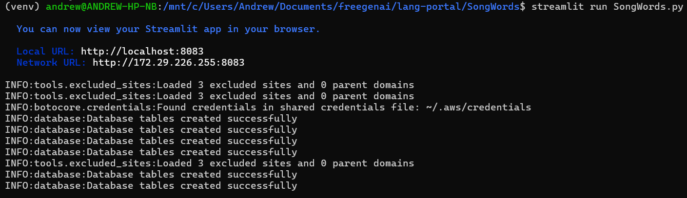
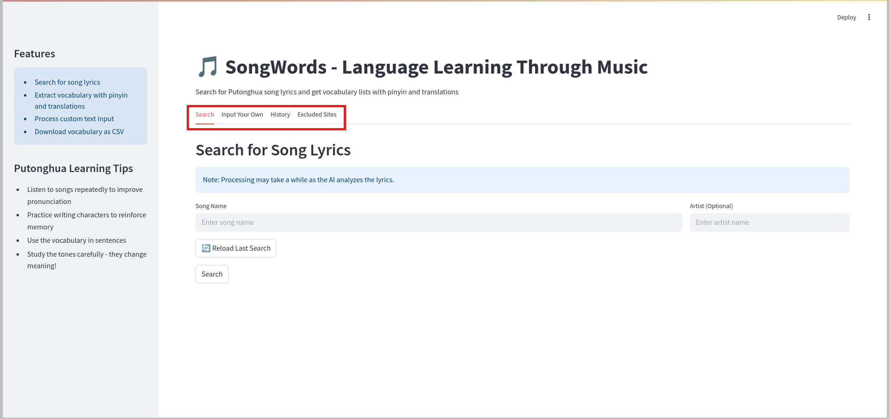
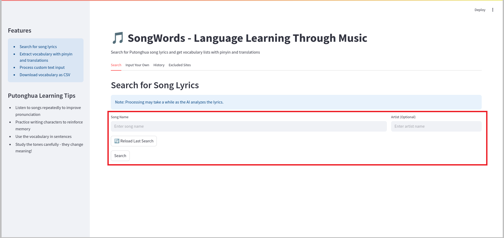
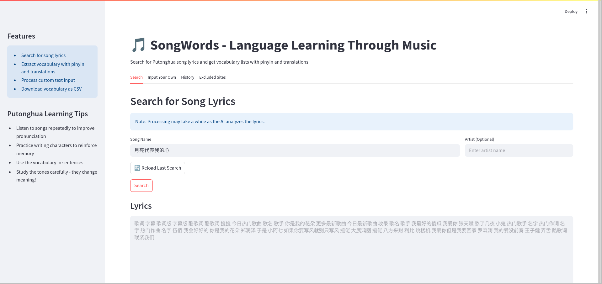
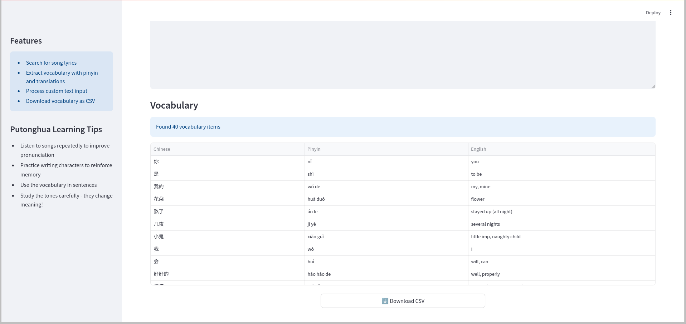
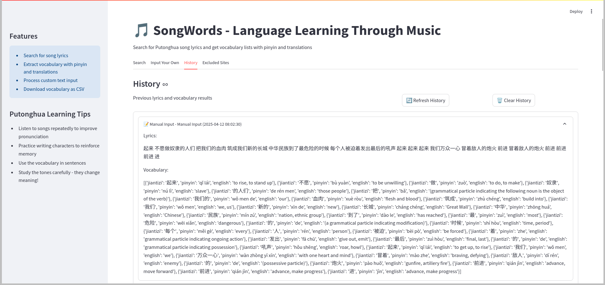
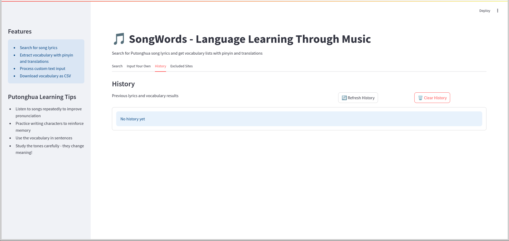
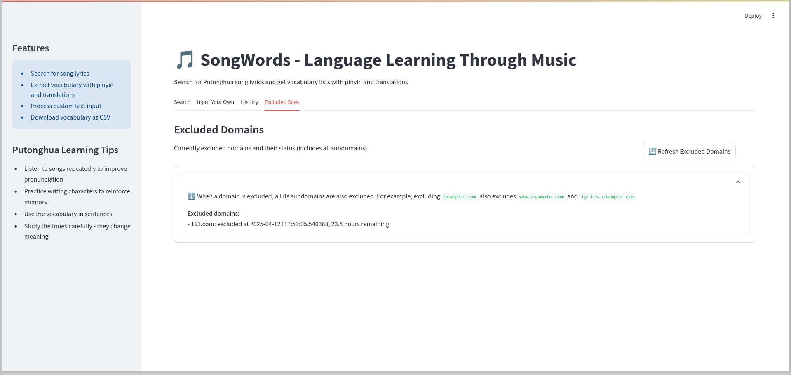

# SongWords Showcase

## Introduction

SongWords is an innovative language learning tool that helps users learn Chinese through music. By leveraging AI technology and web search capabilities, the app automatically finds Chinese song lyrics, extracts vocabulary, and provides translations and pinyin pronunciations. It's designed to make learning Chinese more engaging and contextual through popular music.

## Overview of Features

SongWords offers a comprehensive set of features for music-based language learning:

- **Smart Lyrics Search**: Automatically find Chinese song lyrics from various sources
- **Vocabulary Extraction**: AI-powered identification of key vocabulary from lyrics
- **Translation Support**: Automatic translation and pinyin generation
- **History Tracking**: Save and revisit previous searches
- **Data Export**: Download vocabulary lists in CSV format
- **Site Management**: Control which websites are used for lyrics search
- **Custom Input**: Add your own lyrics for vocabulary extraction

## Feature Tour

### Launch the App

Start SongWords using Streamlit:

```bash
streamlit run SongWords.py
```

*Caption: SongWords initialization showing AWS configuration check*

### Home Screen

The app features a clean, tabbed interface with four main sections:
- Search: Find and analyze song lyrics
- Input Your Own: Manual lyrics entry
- History: View past searches
- Excluded Sites: Manage search sources

### Navigation

The app is organized into four main tabs, each serving a specific purpose:

1. Search Tab: Find and analyze songs
2. Input Tab: Manual lyrics entry
3. History Tab: View past searches
4. Excluded Sites Tab: Search source management


*Caption: SongWords main interface showing the tabbed navigation system highlighted*

### Key Features in Action

#### 1. Song Search
Search for songs with optional artist filtering:
- Song name input
- Artist name input (optional)
- Quick reload of last search
- Real-time search status updates


*Caption: Highlighted song search interface showing search fields and controls*

#### 2. Lyrics Display
View the found lyrics with:
- Original Chinese text
- Automatic simplification
- Clean, readable format


*Caption: Song search interface displaying lyrics found*

#### 3. Vocabulary Analysis
Review extracted vocabulary with:
- Chinese characters
- Pinyin pronunciation
- English translations
- CSV export option


*Caption: Song search interface displaying extracted words and translations*

#### 4. Lyrics Input
Process your own Chinese lyrics:
- Large text input area
- Real-time processing
- Immediate vocabulary extraction
- Error handling
- Quick reload of last request


*Caption: Custom text input interface showing the text area and processing options*


*Caption: Custom text input interface displaying extracted words and translations*

#### 5. History Management
Access your learning history:
- View past requests
- Track learning history
- Reset history


*Caption: History interface showing past searches (part 1)*


*Caption: History interface showing past searches (part 2)*


*Caption: History interface showing clear history function*

### Search Source Management

The app excludes websites it is unable to extract text from for 24 hours:
- Prevents unhelpful websites cloggin up search results
- Allows for changes to the implementation lyrics websites
- View current exclusion list


*Caption: Search source management interface showing excluded sites controls*

## User Experience Guidance

### Pro Tips

1. **Efficient Searching**: 
   - Include artist name for more accurate results
   - Use the reload button to quickly access recent searches
   - Try alternative song titles if initial search fails

2. **Vocabulary Management**:
   - Download vocabulary lists for offline study
   - Review translations for context
   - Track new words across multiple songs

3. **Source Control**:
   - Exclude unreliable lyrics sources
   - Maintain a curated list of preferred sites
   - Reset exclusions if results are too limited

### Best Practices

- Start with songs you're familiar with
- Use the history feature to track your progress
- Export vocabulary lists regularly
- Manage excluded sites to improve search quality
- Input your own lyrics when online search isn't optimal

## Conclusion

SongWords transforms Chinese music into an effective language learning tool. By combining AI-powered lyrics analysis with comprehensive vocabulary extraction, it provides a unique and engaging way to expand your Chinese vocabulary and understanding.

Whether you're a beginner looking to learn through popular music or an advanced learner seeking to expand your vocabulary, SongWords offers the tools and features needed to make learning Chinese through music both effective and enjoyable.
