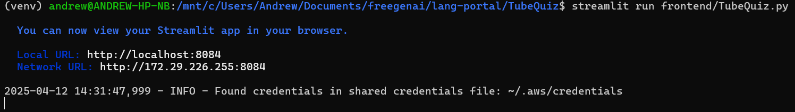
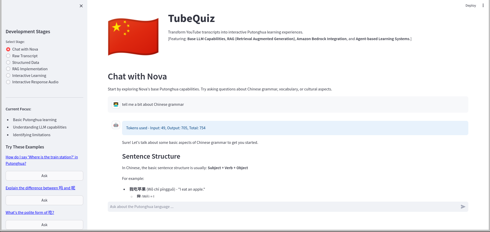
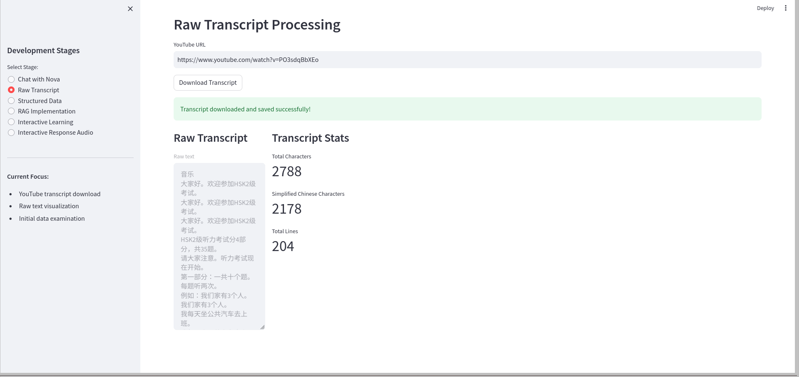
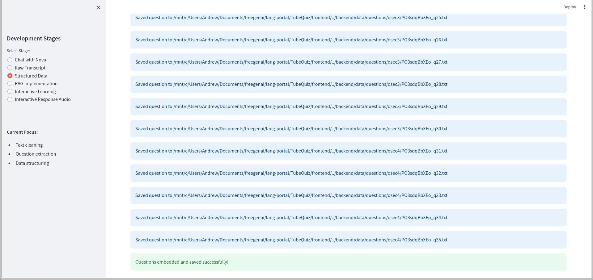
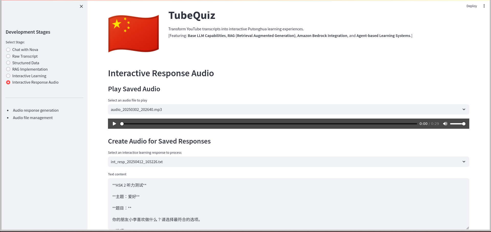

# TubeQuiz

An AI-powered Putonghua learning application that transforms YouTube content into interactive language exercises, integrated with Lang Portal and powered by AWS Bedrock.

## Overview

TubeQuiz bridges the gap between passive video watching and active language learning by combining:
- YouTube content as learning material
- AWS Bedrock and Claude 3 Haiku for AI-powered interactions
- RAG (Retrieval Augmented Generation) for context-aware responses
- Amazon Polly for audio generation
- Lang Portal integration for centralized learning management

## Prerequisites

1. **AWS Setup**
   - AWS CLI installed and configured
   - Access to AWS Bedrock service
   - Claude 3 Haiku model permissions
   - Amazon Polly access
   - AWS Region set to us-west-2 (required for Bedrock)

2. **Lang Portal Backend**
   - Running Lang Portal backend service
   - Default URL: http://localhost:5000

3. **System Dependencies**
   - Python 3.8+
   - FFmpeg for audio processing

## Installation & Configuration

1. **Install System Dependencies**

   For Ubuntu/Debian:
   ```bash
   sudo apt-get update
   sudo apt-get install ffmpeg
   ```

   For Windows:
   - Download FFmpeg from: https://ffmpeg.org/download.html
   - Add to PATH

   For macOS:
   ```bash
   brew install ffmpeg
   ```

2. **Install Python Dependencies**
   ```bash
   pip install -r requirements.txt
   ```

3. **Configure AWS**
   ```bash
   aws configure
   ```
   Enter:
   - AWS Access Key ID
   - AWS Secret Access Key
   - Default region (us-west-2)
   - Output format (json)

4. **Verify Setup**
   ```bash
   # Check AWS credentials
   aws sts get-caller-identity
   
   # Check FFmpeg installation
   ffmpeg -version
   ```

## Getting Started

1. **Start Lang Portal Backend**
   ```bash
   cd path/to/lang-portal/backend-flask
   python app.py
   ```
   
   *Backend service initialization*

2. **Launch TubeQuiz**
   ```bash
   streamlit run frontend/TubeQuiz.py
   ```
   
   *TubeQuiz launch screen with Nova AI assistant*

## Features and Usage

### 1. AI Language Assistant (Nova)
Chat with a specialized Putonghua tutor powered by Claude 3 Haiku:
- Natural language interaction
- Grammar explanations and vocabulary assistance
- Cultural insights and contextual learning


*Nova providing detailed grammar explanations*

### 2. YouTube Integration
Transform any Chinese-language video into learning material:
- Automatic transcript download and processing
- Chinese character analysis
- Text cleaning and formatting
- Saving text and embeddings data


*Caption: Raw transcript processing interface showing downloaded content and analysis*


*Caption: Structured data processing interface showing data processing and saving (part 1)*


*Caption: Structured data processing interface showing data processing and saving (part 2)*

### 3. RAG Implementation
Get context-aware responses and explanations:
- Vector database for semantic search
- Dynamic knowledge updates
- Relevant example retrieval


*Context-aware responses using RAG technology*

### 4. Interactive Learning
Practice with customizable scenarios:
- Topic-based exercises
- HSK-aligned difficulty levels
- Dynamic question generation
- Progress tracking


*Interactive learning with topic selection*

### 5. Audio Generation
Listen to clear pronunciations:
- Text-to-speech with Amazon Polly
- Multiple voice variations
- Audio playback controls


*Caption: Audio interface showing playback controls and file management*


*Caption: Audio interface showing audio generation with text source highlighted*


*Caption: Audio interface showing generated audio with identifying details highlighted*

## Best Practices

### Usage Tips
1. **Quick Access**: Use sidebar example questions for instant practice
2. **Navigation**: Switch between stages using sidebar radio buttons
3. **Keyboard Shortcuts**:
   - `Enter`: Submit response
   - `Space`: Play/pause audio
   - `↑/↓`: Navigate chat history

### Learning Flow
1. Start with Chat stage to learn basic concepts
2. Use RAG for detailed explanations
3. Practice with interactive exercises
4. Reinforce with audio generation
5. Save useful YouTube videos for later practice

## Architecture

```
TubeQuiz/
├── frontend/
│   └── TubeQuiz.py          # Main Streamlit application
├── backend/
│   ├── chat.py              # Nova AI assistant
│   ├── get_transcript.py    # YouTube integration
│   ├── structured_data.py   # Data processing
│   ├── vector_store.py      # RAG components
│   ├── rag.py              # Context retrieval
│   ├── interactive.py       # Exercise generation
│   └── tts.py              # Audio processing
└── requirements.txt
```

## Technical Details

### AWS Services
- **AWS Bedrock**: Powers Nova AI assistant and RAG
- **Amazon Polly**: Generates audio for pronunciation
- **Claude 3 Haiku**: Natural language understanding

### Data Processing
- FAISS for vector storage
- YouTube Transcript API
- FFmpeg for audio processing

## Troubleshooting

### Common Issues

1. **AWS Connectivity**
   - Verify AWS credentials
   - Check Bedrock access
   - Confirm us-west-2 region setup

2. **Audio Generation**
   - Check FFmpeg installation
   - Verify Polly access
   - Check audio file permissions

3. **YouTube Integration**
   - Check video availability
   - Verify subtitle/transcript access
   - Check API rate limits

### Error Logging
- Application logs in console
- Detailed error traces in Streamlit interface


