# TubeQuiz Showcase

## Introduction

TubeQuiz is an innovative language learning application that transforms YouTube content into interactive Putonghua (Standard Mandarin Chinese) learning experiences. By leveraging advanced AI technologies including Amazon Bedrock, RAG (Retrieval Augmented Generation), and interactive learning systems, TubeQuiz creates a unique and engaging environment for learning Chinese.

The app bridges the gap between passive video watching and active language learning by converting YouTube content into structured learning materials with interactive exercises, audio generation, and AI-powered feedback.

## Overview of Features

TubeQuiz offers a comprehensive set of features designed to enhance the language learning experience:

- **AI-Powered Language Assistant**: Chat with Nova, an AI tutor specialized in Putonghua learning
- **YouTube Integration**: Convert any Chinese-language YouTube video into learning material
- **Interactive Exercises**: Practice with dynamically generated language scenarios
- **Audio Generation**: Listen to proper pronunciation with AI-generated audio
- **Smart Context Retrieval**: Get relevant explanations and examples using RAG technology
- **Progress Tracking**: Monitor your learning journey through different stages
- **Multi-Modal Learning**: Combine text, audio, and interactive elements

## Feature Tour

### Launch the App

To start using TubeQuiz, launch the application using Streamlit:

```bash
streamlit run frontend/TubeQuiz.py
```

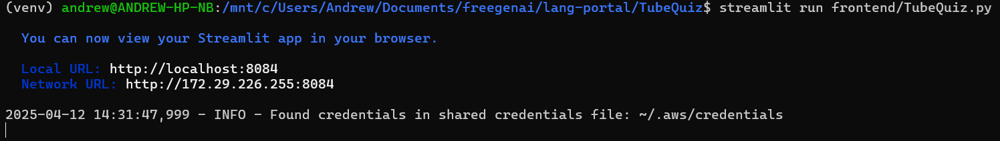
*Caption: TubeQuiz initialization showing AWS configuration check*

### Home Screen

The home screen features a clean, modern interface with a distinctive Chinese flag logo and clear navigation options. The main area displays the current learning stage, while the sidebar provides easy access to different features.

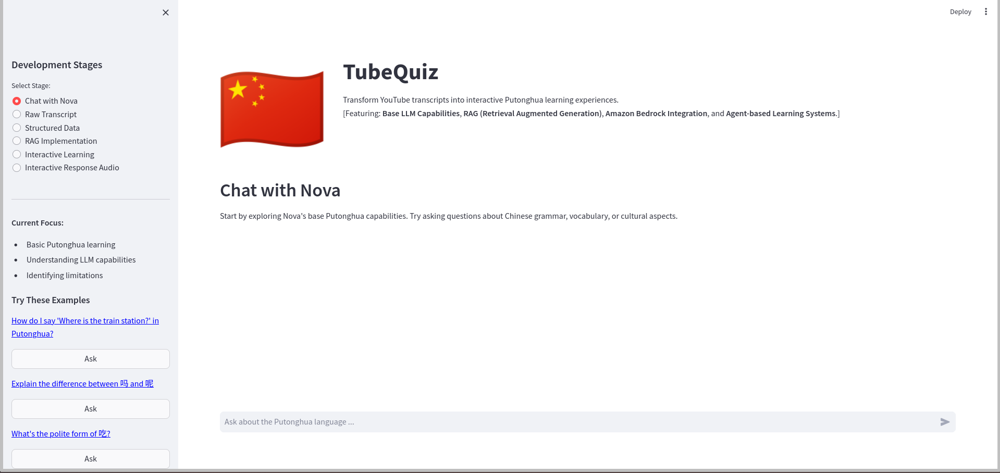
*Caption: Launch screen showing the Putonghua Learning Assistant*

### Navigation

The app is organized into six progressive learning stages, each focusing on different aspects of language learning:

1. Chat with Nova
2. Raw Transcript
3. Structured Data
4. RAG Implementation
5. Interactive Learning
6. Interactive Response Audio

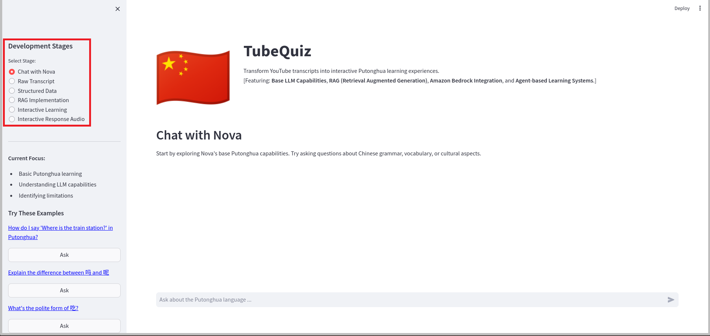
*Caption: Launch screen highlighting the welcome message and sidebar navigation showing all six development stages with descriptions*

### Key Features in Action

#### 1. Chat with Nova
Engage with an AI tutor for Putonghua learning:
- Natural language interaction
- Grammar explanations
- Vocabulary assistance
- Cultural insights
- Example questions provided in sidebar

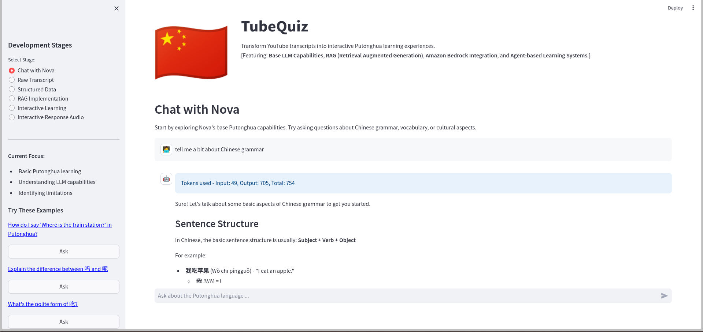
*Caption: Chat interface showing a conversation with Nova about Chinese grammar (part 1)*

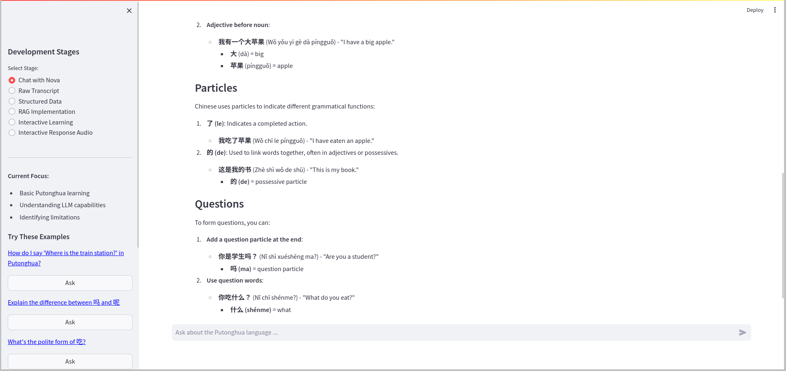
*Caption: Chat interface showing a conversation with Nova about Chinese grammar (part 2)*

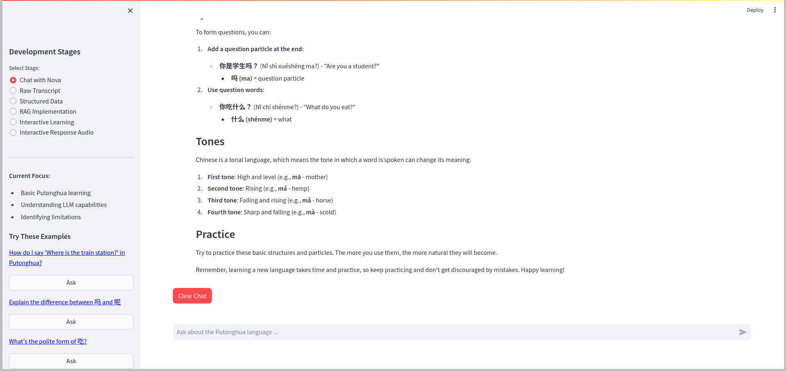
*Caption: Chat interface showing a conversation with Nova about Chinese grammar (part 3)*

#### 2. YouTube Transcript Processing
Transform YouTube content into learning materials:
- Automatic transcript download
- Chinese character analysis
- Text cleaning and formatting
- Content organization
- Saving text and embeddings data

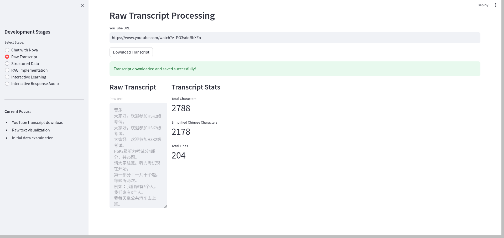
*Caption: Raw transcript processing interface showing downloaded content and analysis*

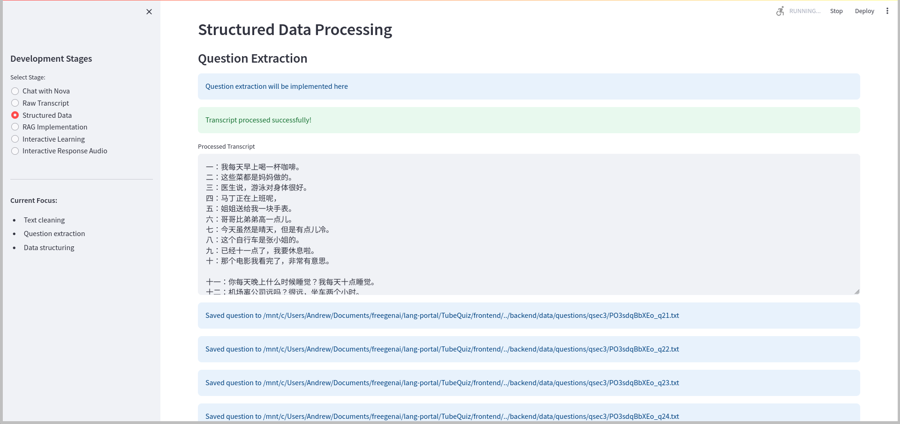
*Caption: Structured data processing interface showing data processing and saving (part 1)*

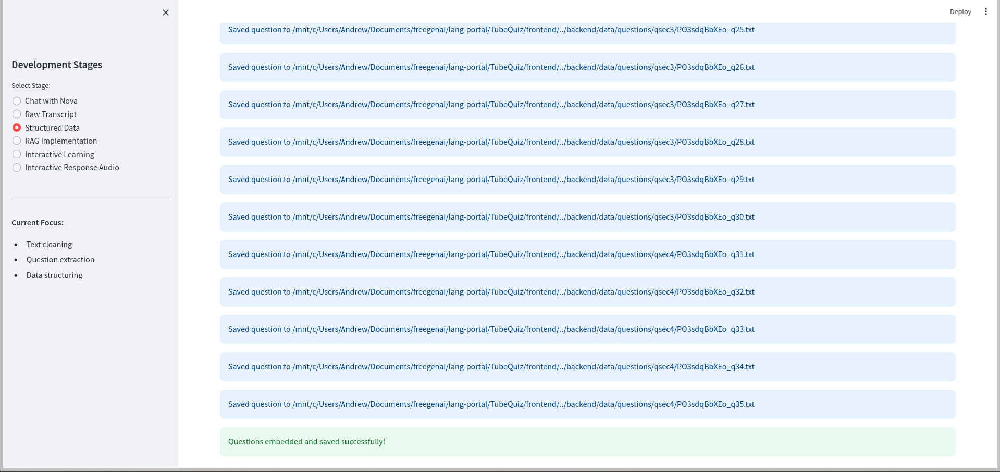
*Caption: Structured data processing interface showing data processing and saving (part 2)*

#### 3. RAG Implementation
Transform AI responses with context-aware learning:
- Vector database integration
- Semantic search capabilities
- Context-enriched responses
- Dynamic knowledge updates

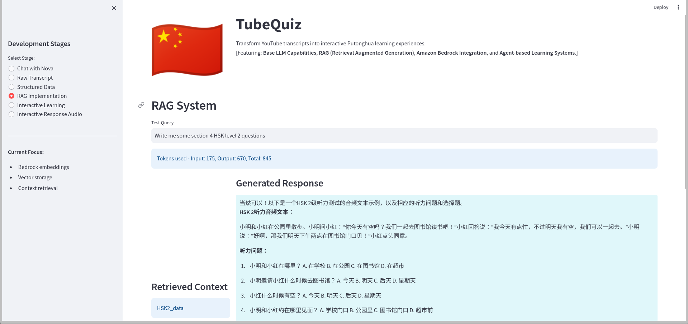
*Caption: RAG implementation showing semantic search and context-aware responses (part 1)*

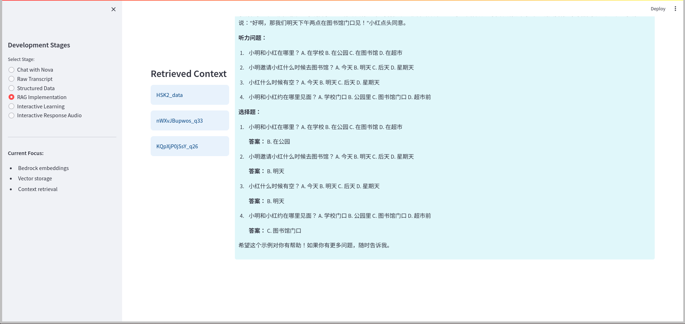
*Caption: RAG implementation showing semantic search and context-aware responses (part 2)*

#### 4. Interactive Learning
Practice with customizable scenarios:
- Topic selection
- Difficulty levels (HSK-based)
- Question types
- Context-aware exercises

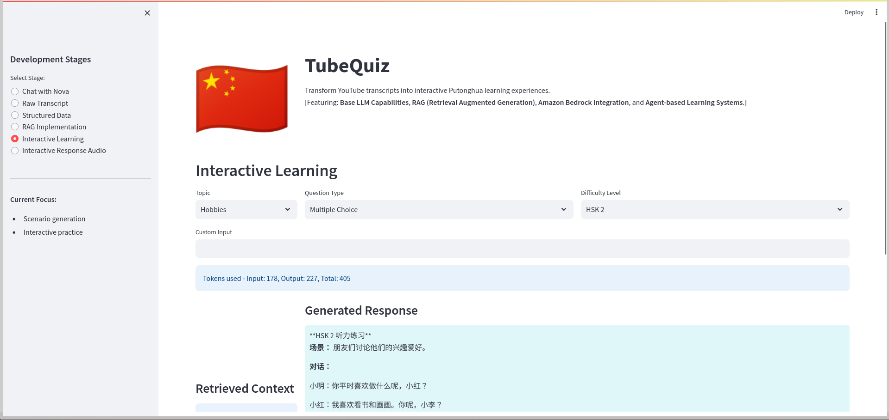
*Caption: Interactive learning interface showing topic selection and exercise generation (part 1)*

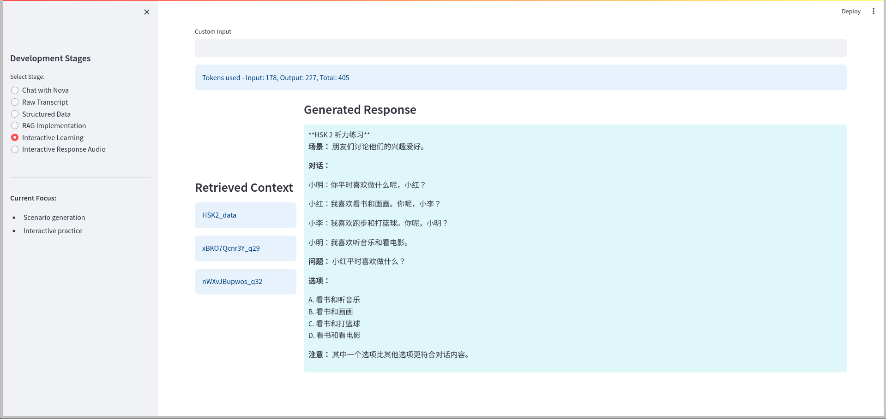
*Caption: Interactive learning interface showing topic selection and exercise generation (part 2)*

#### 5. Audio Generation
Listen to clear pronunciations:
- Text-to-speech conversion
- Audio file management
- Playback controls
- Response recording

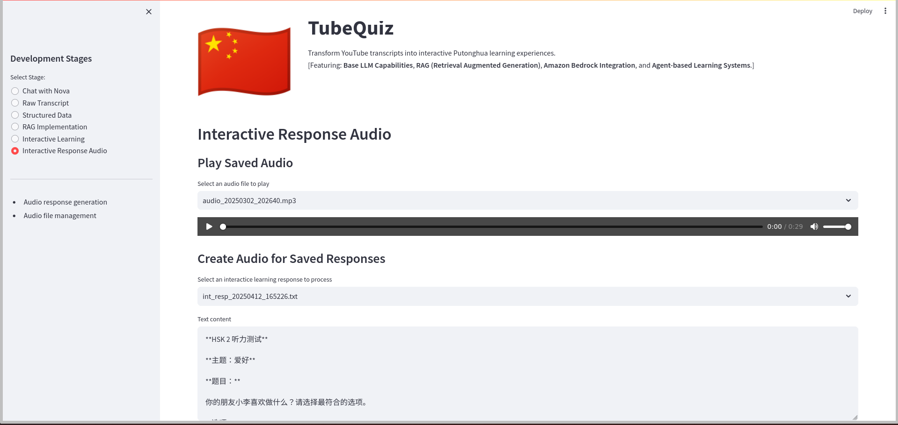
*Caption: Audio interface showing playback controls and file management*

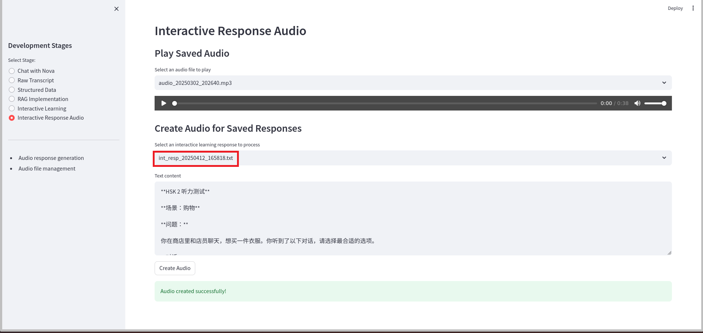
*Caption: Audio interface showing audio generation with text source highlighted*

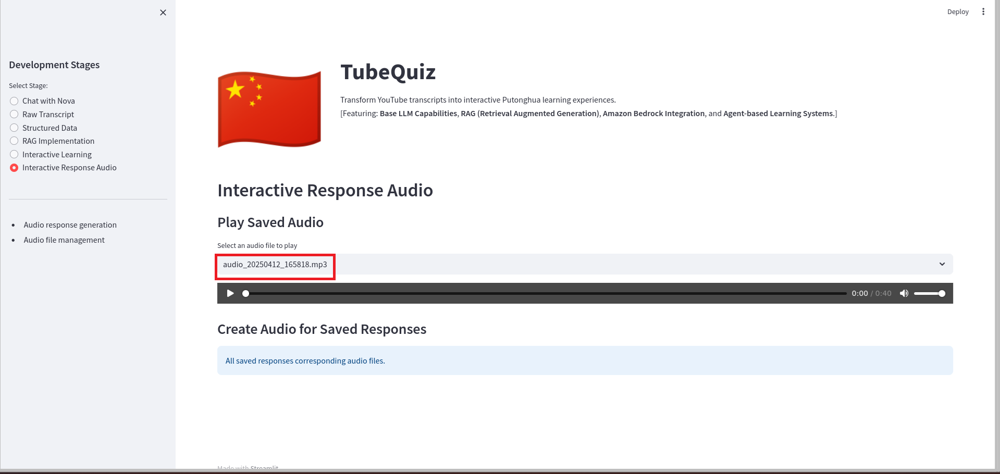
*Caption: Audio interface showing generated audio with identifying details highlighted*

## User Experience Guidance

### Pro Tips

1. **Quick Access to Examples**: Use the sidebar's example questions for instant practice scenarios
2. **Efficient Navigation**: Switch between stages using the sidebar radio buttons
3. **Keyboard Shortcuts**:
   - `Enter`: Submit your response
   - `Space`: Play/pause audio
   - `↑/↓`: Navigate through chat history

### Best Practices

- Start with the Chat stage to familiarize yourself with basic concepts
- Use the RAG implementation for detailed explanations of complex topics
- Combine audio practice with interactive exercises for better retention
- Save interesting YouTube videos for later practice sessions

## Conclusion

TubeQuiz represents a significant advancement in language learning technology, combining the accessibility of YouTube content with sophisticated AI-powered learning tools. Whether you're a beginner or an advanced learner, TubeQuiz provides a structured, engaging way to improve your Putonghua skills.

The app's progression through six distinct stages ensures a comprehensive learning experience, while its integration of multiple learning modalities caters to different learning styles. We encourage you to explore all features and make TubeQuiz a regular part of your language learning journey.

Start your Putonghua learning adventure today with TubeQuiz, where every YouTube video becomes an opportunity for language mastery!
