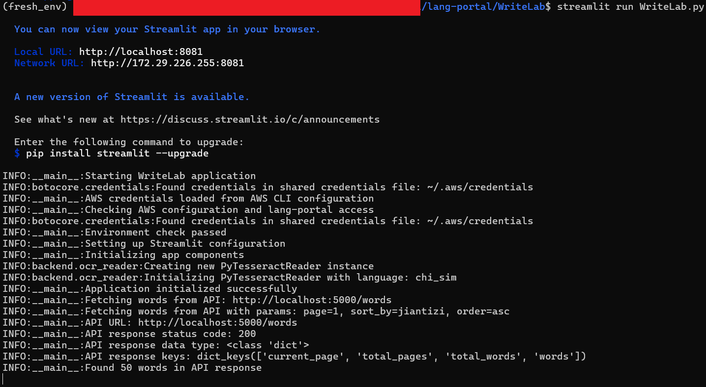
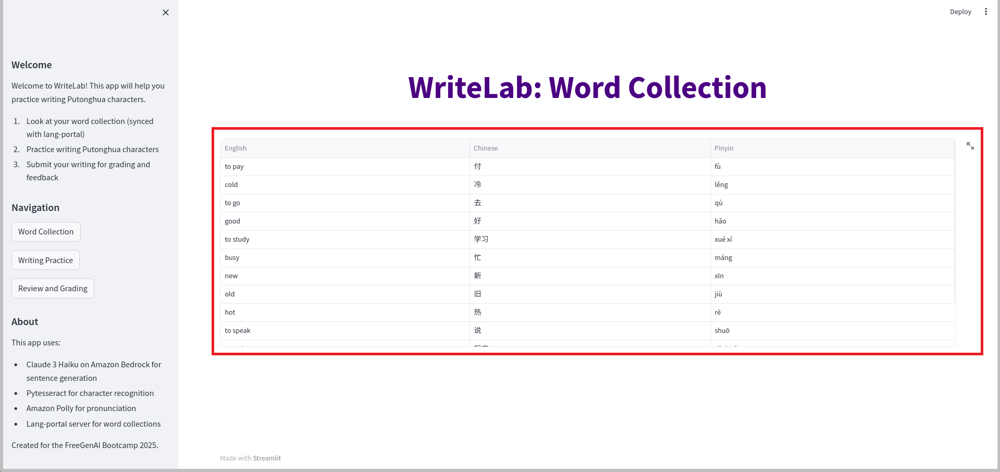
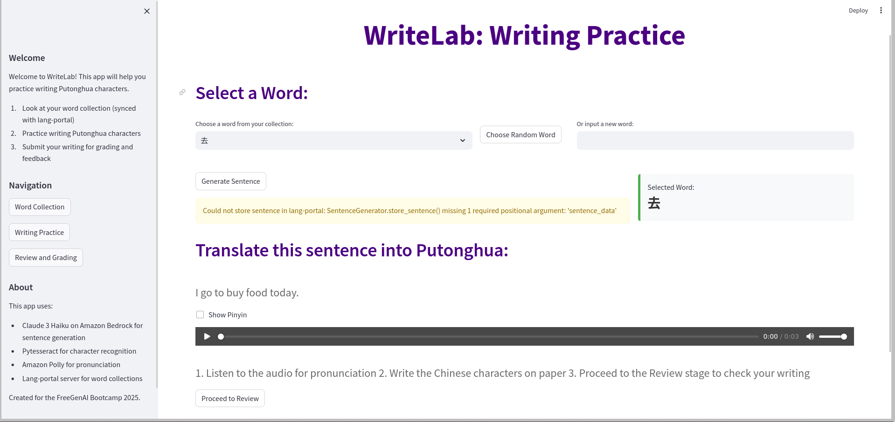
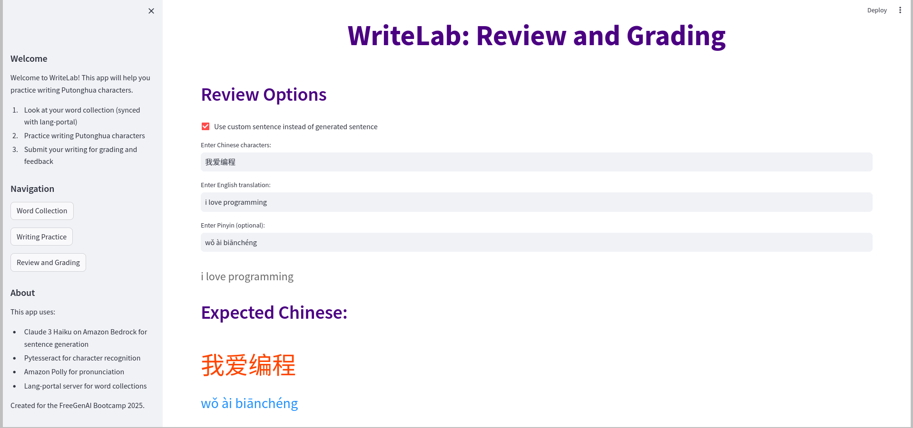
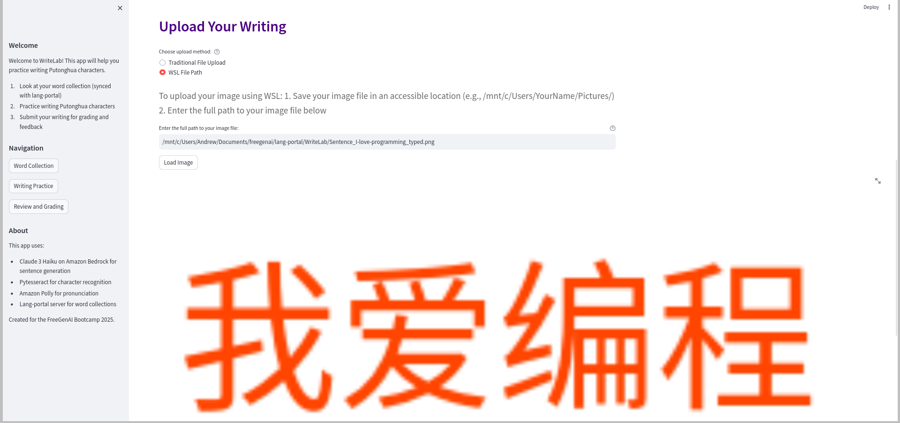
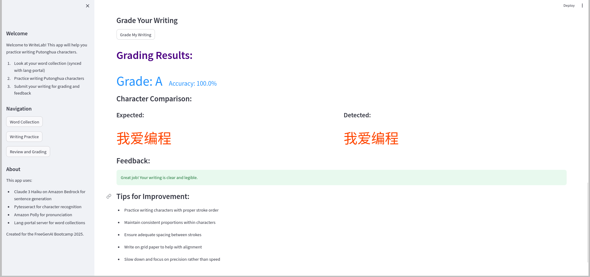

# WriteLab

A sophisticated Chinese character writing practice application integrated with Lang Portal, powered by AWS Bedrock and Claude 3 Haiku for AI-assisted learning.

## Overview

WriteLab provides an interactive environment for practicing Chinese character writing with real-time assessment and guidance. The application combines:
- AI-powered feedback using AWS Bedrock and Claude 3 Haiku
- Centralized vocabulary management through Lang Portal integration
- Advanced OCR technology for character recognition
- Audio support for pronunciation practice

## Prerequisites

1. **AWS Setup**
   - AWS CLI installed and configured with credentials
   - Access to AWS Bedrock service
   - Claude 3 Haiku model permissions
   - AWS Region set to where Bedrock is available (e.g., us-west-2)

2. **Lang Portal Backend**
   - Running Lang Portal backend service (provides vocabulary database)
   - Default URL: http://localhost:5000

3. **System Dependencies**
   - Python 3.8+
   - Tesseract OCR with Chinese language support

## Installation & Setup

1. **Install System Dependencies**
   
   For Ubuntu/Debian:
   ```bash
   sudo apt-get update
   sudo apt-get install tesseract-ocr
   sudo apt-get install tesseract-ocr-chi-sim
   ```
   
   For Windows:
   - Download Tesseract installer from: https://github.com/UB-Mannheim/tesseract/wiki
   - Add Tesseract to PATH
   
   For macOS:
   ```bash
   brew install tesseract tesseract-lang
   ```

2. **Install Python Dependencies**
   ```bash
   pip install -r requirements.txt
   ```

3. **Configure AWS**
   ```bash
   aws configure
   ```
   Enter:
   - AWS Access Key ID
   - AWS Secret Access Key
   - Default region (us-west-2 recommended)
   - Output format (json recommended)

4. **Verify Setup**
   - Check Tesseract: `tesseract --version`
   - Verify AWS credentials: `aws sts get-caller-identity`
   - Ensure Lang Portal is running: `http://localhost:5000`

## Getting Started

1. **Start Lang Portal Backend**
   ```bash
   cd path/to/lang-portal/backend-flask
   python app.py
   ```
   
   *Lang-Portal backend service initialization*

2. **Launch WriteLab**
   ```bash
   cd path/to/WriteLab
   streamlit run WriteLab.py
   ```
   
   *WriteLab initialization showing AWS configuration check*

## Core Features

### 1. Word Collection
Browse and manage your Chinese vocabulary with detailed character information:
- Character variants (Traditional/Simplified)
- Pronunciation
- Usage examples


*Word Collection interface showing vocabulary management*

### 2. Writing Practice
Generate and study Chinese sentences with:
- Dynamic sentence generation
- Character stroke guidance
- Audio pronunciation support


*Writing Practice interface with sentence generation*

### 3. Review and Grading
Submit and receive AI-powered feedback on your writing:
- Image upload for handwritten work
- OCR recognition
- Detailed character-by-character analysis
- Comprehensive grading


*Feedback and grading interface displaying expected writing*


*Uploading writing for grading*


*AI-powered writing feedback and grading*

## Best Practices

### Image Submission
- Use high-contrast black ink
- Ensure good lighting
- Maintain consistent character size
- Supported formats: PNG, JPEG

### Practice Workflow
1. Start with word collection
2. Practice writing generated sentences
3. Submit for immediate feedback
4. Review and improve based on AI analysis

## Architecture

```
WriteLab/
├── WriteLab.py           # Main application
├── config.py            # Configuration settings
├── frontend/           # UI components
│   ├── styling.py     # CSS and styling
│   └── state_management.py
├── backend/           # Core functionality
│   ├── ocr_reader.py
│   ├── audio_generation.py
│   ├── image_processing.py
│   └── sentence_generation.py
└── requirements.txt
```

## Troubleshooting

### Common Issues

1. **AWS Connectivity**
   - Verify AWS credentials: `aws sts get-caller-identity`
   - Check Bedrock access in AWS Console
   - Confirm region has Bedrock support

2. **Lang Portal Connection**
   - Ensure backend is running on port 5000
   - Check for "Connection refused" errors
   - Verify API endpoints are accessible

3. **OCR Issues**
   - Confirm Tesseract installation
   - Check Chinese language support
   - Verify image quality and format

### Error Logging
- Application logs: `writelab_YYYYMMDD.log`
- OCR debug information: `ocr_debug.log`
- Detailed error traces in Streamlit interface
