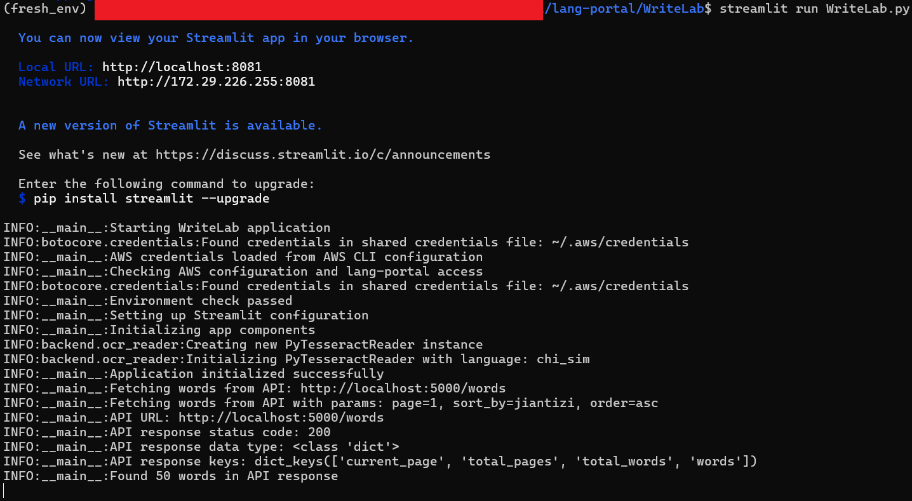
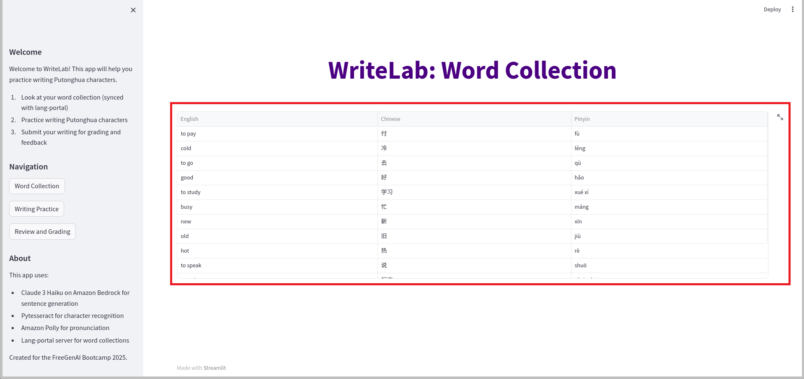
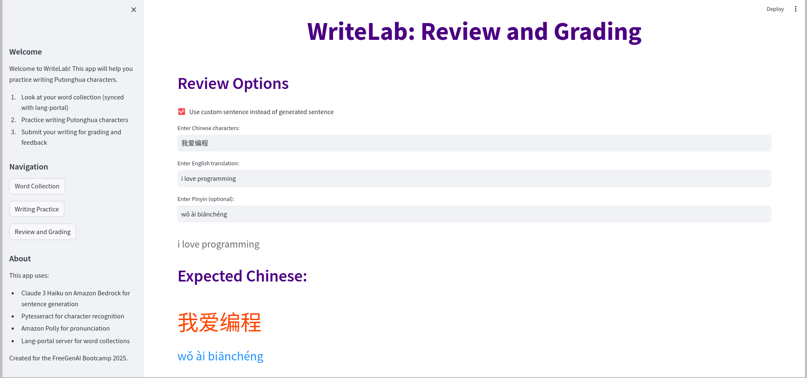
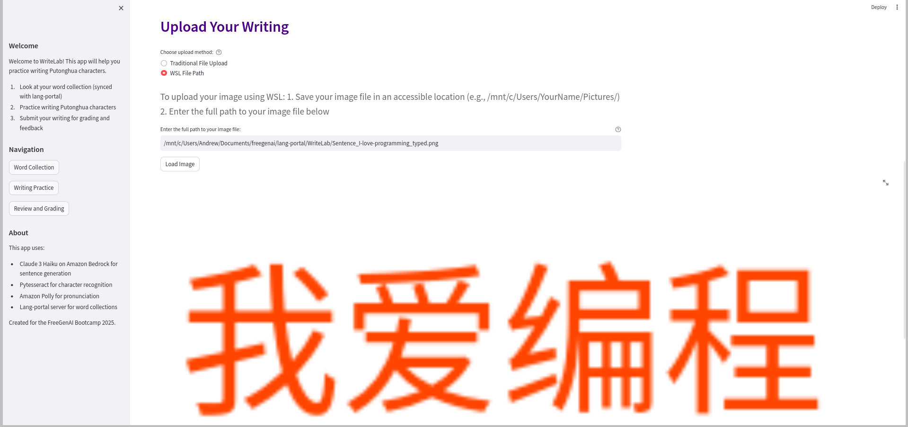
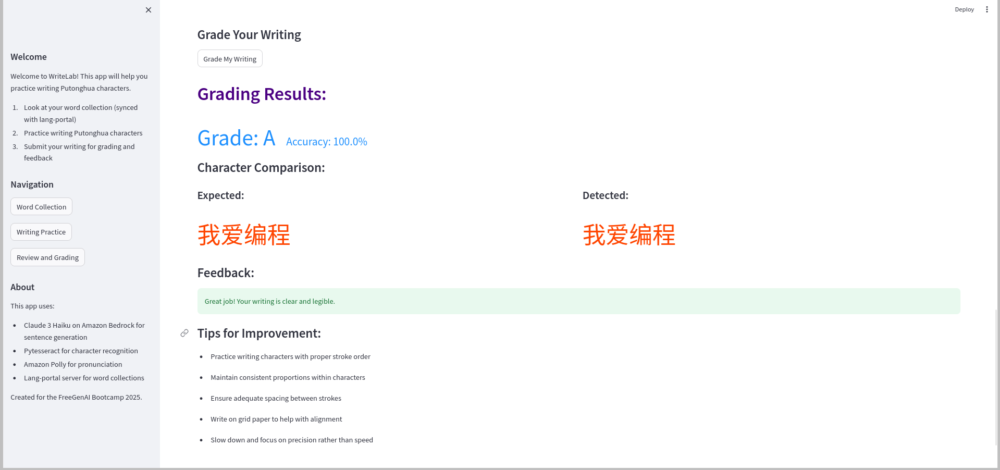

# WriteLab Showcase

## Introduction

WriteLab is a sophisticated Chinese character writing practice application that combines AI-powered feedback with structured learning methodologies. Using AWS Bedrock and advanced OCR technology, the app provides an interactive environment for practicing Chinese character writing with real-time assessment and guidance.

## Overview of Features

WriteLab offers three main components designed to create a comprehensive learning experience:

- **Word Collection**: Curated vocabulary lists with character details
- **Writing Practice**: Interactive character writing exercises with audio support
- **Review and Grading**: AI-powered assessment of handwritten characters

Key capabilities include:
- **Intelligent Word Management**: Access to curated word lists via API integration
- **Dynamic Sentence Generation**: Context-aware practice material
- **Advanced OCR Recognition**: Precise character analysis using Tesseract
- **AI Feedback System**: Detailed writing assessment using Claude Haiku
- **Audio Support**: Text-to-speech for pronunciation practice
- **Progress Tracking**: Comprehensive grading and improvement monitoring

## Feature Tour

### Launch the App

#### Prerequisites

Before starting WriteLab, you must first launch the Lang Portal backend service which provides access to the main vocabulary database:

1. Navigate to the Lang Portal directory:
```bash
cd path/to/lang-portal/backend-flask
```

2. Start the Lang Portal service:
```bash
python app.py
```


*Caption: Lang-Portal backend service initialization*

3. Wait for the service to start (it will run on http://localhost:5000)

#### Starting WriteLab

1. Navigate to the WriteLab directory:
```bash
cd path/to/WriteLab
```

2. Run WriteLab app:
```bash
streamlit run WriteLab.py
```


*Caption: WriteLab initialization showing AWS configuration check*


> **Important**: If you see a "Connection refused" error, make sure the Lang Portal service is running on port 5000 before starting Writing Practice.

### Home Screen

The app features a modern, wide-layout interface with:
- Clear navigation sidebar
- Welcome message and instructions
- Three main sections: Word Collection, Writing Practice, and Review
- Clean, intuitive design optimized for learning


*Caption: WriteLab's launch screen showing vocabulary extraction from Lang-Portal*

### Navigation

The app provides straightforward navigation through three main stages:

1. Word Collection: Browse and select vocabulary
2. Writing Practice: Generate and practice writing sentences
3. Review and Grading: Submit and receive feedback


*Caption: Navigation sidebar showing the three main stages*

### Key Features in Action

#### 1. Word Collection
Browse and manage your Chinese vocabulary with detailed character information:
- Character variants (Traditional/Simplified)
- Pronunciation
- Usage examples


*Caption: Highlighted Word Collection interface showing the vocabulary table with translations*

#### 2. Writing Practice
Generate practice sentences and receive audio support:
- Dynamic sentence generation
- Character stroke guidance
- Audio pronunciation


*Caption: Navigated to Writing Practice section showing word selection and sentence generation options*


*Caption: Writing Practice section showing sentence generation output*

Learner Support:
- Audio pronunciation
- Pinyin toggle


*Caption: Audio playback controls with the sentence displayed*

#### 3. Review and Grading
Check your writing progress:
- Image upload for written work
- OCR recognition
- Automatic grading
- Detailed feedback
- Custom sentence input option


*Caption: Navigated to Review and Grading section showing review options and expected Chinese writing*


*Caption: Uploaded image of writing practice*


*Caption: Grading and feedback*

## User Experience Guidance

### Pro Tips

1. **Environment Setup**: 
   - Configure AWS CLI before first use
   - Verify Tesseract OCR installation
   - Test API connectivity

2. **Image Submission**: 
   - Use high-contrast black ink
   - Ensure good lighting
   - Maintain consistent character size

3. **Practice Workflow**:
   - Start with word collection
   - Practice writing generated sentences
   - Submit for immediate feedback

### Best Practices

- Regularly update AWS credentials
- Use recommended image formats (PNG, JPEG)
- Practice with generated sentences before free writing
- Review feedback patterns to identify areas for improvement

## Conclusion

WriteLab represents a modern approach to Chinese character writing practice, combining traditional methods with AI technology. The app's three-stage workflow - from word collection through practice to review - provides a structured path for improving Chinese writing skills.

The integration of AWS services, OCR technology, and AI feedback creates a powerful learning environment that adapts to each user's needs. Whether you're beginning your journey in Chinese writing or looking to perfect your character formation, WriteLab provides the tools and guidance needed for success.
